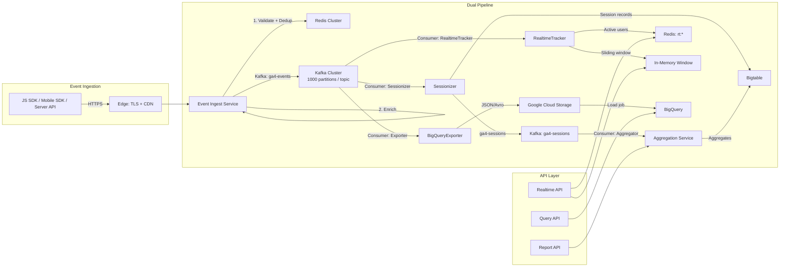
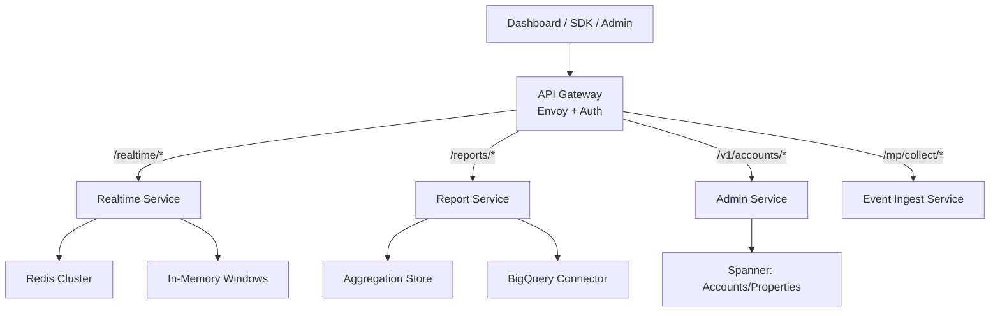

## Architecture Overview

Google Analytics operates **two parallel data pipelines** serving different latency requirements:

### Pipeline characteristics

| Pipeline | Path | Latency | Storage | Purpose |
|----------|------|---------|---------|---------|
| **Real-time** | Ingest → Kafka → RealtimeTracker → Redis/In-memory → Realtime API | 1s–30s | TTL-based (30min) | Active users, top-N, recent events |
| **Batch** | Ingest → Kafka → Sessionizer → Aggregator → Bigtable → Report API | 2h | 13 months | Daily reports, custom queries |
| **Export** | Ingest → Kafka → Exporter → GCS → BigQuery | 2–4h | 13 months | Ad-hoc SQL, data science |

### Design principles

- **Partitioning by `property_id`:** all services isolate tenant data via consistent hashing
- **Region-based processing:** US, EU, APAC regions with DNS-based routing for data residency
- **Tiered storage:** hot (in-memory) → warm (Bigtable) → cold (BigQuery)
- **Async processing:** fire-and-forget event ingestion; consumers pull at their own pace

## Technology Stack

| Component | Choice | Rationale |
|-----------|--------|-----------|
| Message queue | Kafka (1000 partitions, ISR 3) | Cross-region replication, open ecosystem, ordered partitioning |
| In-memory cache | Redis Cluster (16k slots, 3 replicas) | Low-latency counters, sorted sets for top-N, atomic operations |
| Key-value store | Cloud Bigtable (1M writes/sec) | Write throughput for time-series, cost efficiency vs Spanner |
| Columnar warehouse | BigQuery (serverless) | Petabyte SQL, native GCS integration, $0 storage overhead |
| API gateway | Google API Gateway (Envoy) | Auth, rate limiting, per-property quotas |
| Session processing | Stateful Kafka consumers | Exactly-once session boundaries without external state store |

## Data Flow

See [Data Flow](../04-data-flow/) for detailed path-by-path breakdown:
- Event Ingestion Path
- Sessionization
- Aggregation & Rollup
- Report Query Path
- BigQuery Export Path
- Real-Time Tracking Path

## Scalability & Partitioning

**Ingestion scale:** 10M events/sec peak = ~2KB per event = ~20GB/sec write throughput

| Layer | Partitioning | Scale Unit |
|-------|-------------|------------|
| Kafka topics | hash(property_id), 1000 partitions | ~10K events/sec per partition |
| Sessionizer | 1 instance per 100 properties | 10K sessions/instance, LRU eviction |
| Aggregation | shard by property_id + date | Single shard per (property, day) |
| Report queries | fan-out to shards | Parallel merge at query engine |
| Redis | 16k hash slots across nodes | ~580 QPS per slot |

**Long-tail handling:** Top 1000 sites generate 50% of traffic. Partition scheme ensures hot properties don't starve cold ones — each property_id maps to independent partition.

## Fault Tolerance

| Failure Mode | Mitigation | Recovery |
|-------------|------------|----------|
| Consumer crash | Kafka offset + periodic session flush to Bigtable | Resume from last offset; session window rebuild from Bigtable |
| Kafka broker failure | ISR replication (factor 3) | Leader election; no data loss |
| Redis master failure | 3 replica auto-failover | Switchover in < 10s; in-memory window rebuilds from Kafka |
| BigQuery load duplication | Idempotent partition keys | Same event never loaded twice |
| Region outage | DNS failover to secondary region | 5min RTO; data gap visible in reports |

## API Layer Architecture

### Service boundaries

| Service | Responsibility | SLA |
|---------|---------------|-----|
| Event Ingest | Validate, dedup, enrich, write to Kafka | 99.99% |
| Realtime | Active user count, top-N, recent events | 99.95% |
| Report | Aggregated queries, sampling, segments | 99.95% |
| Admin | Account/property/streams CRUD, IAM | 99.95% |
| Export | Batch to GCS, BigQuery load | Best-effort |
