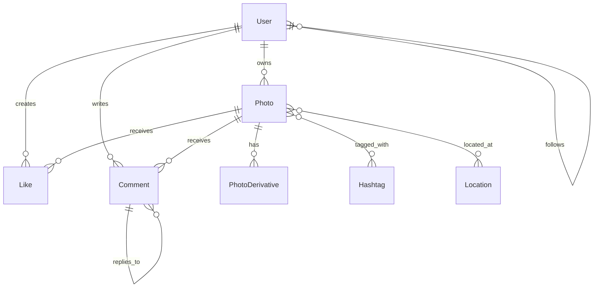

## Entity Definitions

### User

| Field | Type | Notes |
| --- | --- | --- |
| id | UUID | Primary key |
| username | string | Unique, 3–30 chars, used in URLs |
| email | string | Unique, used for auth |
| password_hash | string | Bcrypt/Argon2 hashed |
| display_name | string | Optional, shown on profile |
| bio | string | Optional, up to 150 chars |
| profile_picture_url | string | CDN URL to avatar |
| account_type | enum | `personal`, `creator`, `business` |
| is_private | boolean | If true, follow must be approved |
| created_at | timestamp | Account creation time |
| last_active_at | timestamp | For stale-account detection |

### Photo

| Field | Type | Notes |
| --- | --- | --- |
| id | UUID | Primary key, globally unique |
| owner_id | UUID (FK→User) | The user who uploaded it |
| storage_key | string | Object store path (e.g., S3 key) |
| width | int | Original image width in px |
| height | int | Original image height in px |
| format | string | `jpeg`, `png`, `heic`, `mp4` |
| duration | int (nullable) | Video duration in seconds |
| created_at | timestamp | Upload time |
| caption | string | Optional, up to 2,200 chars |
| location_id | UUID (FK→Location, nullable) | Geo tag if provided |
| filter_applied | string (nullable) | Name of the filter applied client-side |

### PhotoDerivative

Each original photo is processed into multiple resolutions for different display contexts.

| Field | Type | Notes |
| --- | --- | --- |
| id | UUID | Primary key |
| photo_id | UUID (FK→Photo) | Parent photo |
| resolution_label | enum | `thumb` (150px), `small` (320px), `large` (1080px), `original` |
| url | string | CDN-signed or public URL |
| width | int | |
| height | int | |
| file_size | int | Bytes |

### Follow

| Field | Type | Notes |
| --- | --- | --- |
| follower_id | UUID (FK→User) | Who is following |
| followee_id | UUID (FK→User) | Who is being followed |
| created_at | timestamp | |

Unique constraint: `(follower_id, followee_id)`. For private accounts, add a `status` field (`pending`/`accepted`/`rejected`) before the follow becomes active.

### Like

| Field | Type | Notes |
| --- | --- | --- |
| id | UUID | Primary key |
| photo_id | UUID (FK→Photo) | |
| user_id | UUID (FK→User) | |
| created_at | timestamp | |

Unique constraint: `(photo_id, user_id)`. Like counts are cached separately to avoid counting from the table on every read.

### Comment

| Field | Type | Notes |
| --- | --- | --- |
| id | UUID | Primary key |
| photo_id | UUID (FK→Photo) | |
| user_id | UUID (FK→User) | |
| body | string | Up to 2,200 chars |
| created_at | timestamp | |
| parent_comment_id | UUID (FK→Comment, nullable) | Nullable for top-level comments; set for replies |

### Hashtag

| Field | Type | Notes |
| --- | --- | --- |
| id | UUID | Primary key |
| tag_name | string | Unique, lowercase, stored without `#` |

### PhotoHashtag

Junction table: many-to-many between Photos and Hashtags.

| Field | Type | Notes |
| --- | --- | --- |
| photo_id | UUID (FK→Photo) | |
| hashtag_id | UUID (FK→Hashtag) | |

Unique constraint: `(photo_id, hashtag_id)`.

### Location

| Field | Type | Notes |
| --- | --- | --- |
| id | UUID | Primary key |
| name | string | Place name |
| latitude | float | |
| longitude | float | |
| city | string | |
| country | string | |

### PhotoLocation

| Field | Type | Notes |
| --- | --- | --- |
| photo_id | UUID (FK→Photo) | |
| location_id | UUID (FK→Location) | |

---

## Relationships

