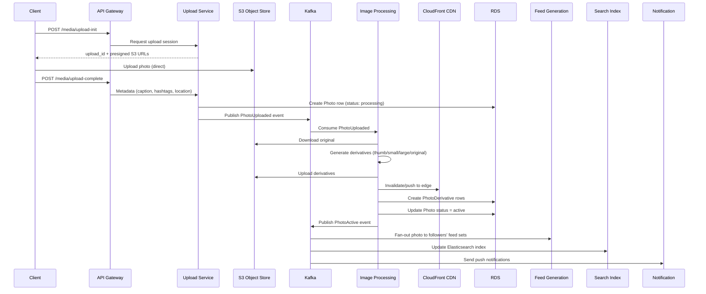

## Write Path

### Photo Upload Flow

---

## Read Path

### Home Feed Read Flow

1. Client calls `GET /feed/home` with cursor.
2. Feed Service checks **Redis cache** (key: `user_id:cursor`).
3. Cache hit → return immediately. Cache miss → read from **Feed Set** (per-user NoSQL set of photo IDs, ordered by timestamp).
4. For each photo ID, fetch full metadata from the Photo Service (Cassandra with read replicas).
5. Filter out photos older than 6 months.
6. Return `FeedItem[]` + next cursor.
7. Write page back to Redis (TTL: 30 min for active users, 5 min for others).

### Profile Page Read Flow

1. Client calls `GET /feed/user/:userId`.
2. Photo Service queries photos by `owner_id`, ordered by `created_at DESC`.
3. Uses index on `(owner_id, created_at)` in RDS or scans Cassandra partition.
4. Fetches like/comment counts from atomic counters (Redis or Cassandra).
5. Returns page of photos with embedded metadata.

### Photo Detail Read Flow

1. Client calls `GET /media/:photo_id`.
2. Photo Service looks up photo by ID.
3. Returns metadata + derivative URLs + like_count + comment_count.
4. If authenticated, checks `likes` table (indexed by `photo_id + user_id`) to include `has_liked` flag.

---

## Sync / Replication Flow

### Cross-Region Replication

| Component | Replication Strategy |
| --- | --- |
| **S3 (Images)** | Cross-region replication to secondary DC |
| **CloudFront (CDN)** | Edge caches serve globally automatically |
| **RDS (User, Photo)** | Multi-AZ + read replicas; cross-region replicas for critical tables |
| **Cassandra (Feed Sets, Likes, Comments)** | Multi-datacenter replication (RF=3, one replica per DC) |

### Cache Invalidation

- **Photo upload:** Clear the uploader's profile cache.
- **Like/Comment:** Atomic counter increments — no cache invalidation needed.
- **Follow/Unfollow:** Feed Generation Service updates the follower's feed set immediately (pull-based model). Feed is refreshed on next app open.
