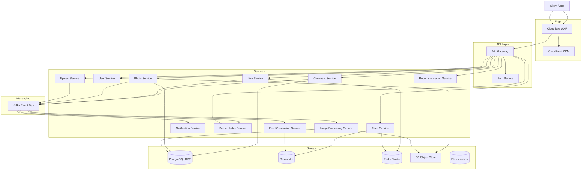

## Architecture Overview

### Design Philosophy

Instagram is heavily **read-optimized** (10B feed reads/day vs 50M uploads). The key design challenge is the **feed fan-out**: when a user with N followers posts, we must make their photo visible to N feeds.

Two strategies exist:

| Strategy | How It Works | Pros | Cons |
| --- | --- | --- | --- |
| **Write-ahead** | On upload, push photo ID into every follower's feed set | Fast reads (O(1) from a set) | Slow writes for power users (fan-out to millions) |
| **Pull-based** | On feed request, query and merge-sort followed users' photos | Fast writes | Slow reads (N queries + merge) |

Instagram uses a **hybrid approach**: write-ahead for normal users (&lt;10K followers) and pull-based for celebrities/power users. Their followers' feeds are assembled at read time.

### Architecture Layers

---

## Component Overview

| # | Component | Responsibility |
| --- | --- | --- |
| 1 | **Client** | Photo capture, feed browsing, social interactions |
| 2 | **API Gateway** | TLS termination, rate limiting, request routing, load balancing |
| 3 | **Auth Service** | JWT issuance, token validation, session management |
| 4 | **Upload Service** | Presigned URL generation, upload validation, metadata collection |
| 5 | **Photo Service** | Photo/derivative CRUD, metadata queries |
| 6 | **Feed Service** | Assembles home feed and user feeds from Feed Sets |
| 7 | **User Service** | Profiles, search, follower/following management |
| 8 | **Like Service** | Like/unlike, atomic counters for like counts |
| 9 | **Comment Service** | Comment CRUD, threaded replies |
| 10 | **Image Processing** | Derivative generation, quality checks |
| 11 | **Feed Generation** | Fan-out logic (write-ahead + pull-based hybrid) |
| 12 | **Notification** | Push dispatch via FCM/APNs |
| 13 | **Search Index** | Elasticsearch index maintenance |
| 14 | **Recommendation** | ML-powered Explore feed ranking |

---

## Technology Choices

| Component | Choice | Rationale |
| --- | --- | --- |
| Load Balancer | NGINX / AWS ALB | Layer 7 routing, TLS termination |
| API Gateway | Kong or custom Go | Rate limiting, auth middleware |
| App Framework | Go (core), Python (ML) | Go: high throughput, low GC latency. Python: rich ML ecosystem |
| Relational DB | PostgreSQL (RDS) | User accounts, Photo metadata, Follow relationships. Read replicas for scale. |
| NoSQL (Feed Sets) | Apache Cassandra | Append-only wide-column store. Multi-DC replication for HA. |
| Cache / Counters | Redis Cluster | Feed page cache, atomic counters, session store |
| Object Store | AWS S3 | Durability, cross-region replication, lifecycle policies |
| CDN | CloudFront | 400+ edge locations for global image delivery |
| Message Queue | Apache Kafka | Durable event bus, 7-day retention, replay capability |
| Search | Elasticsearch | Full-text search, fuzzy matching for hashtags/users |
| Notifications | FCM + APNs | Industry-standard push services for Android/iOS |
| Monitoring | Prometheus + Grafana + ELK + Jaeger | Metrics, logs, tracing |
| Deployment | EKS (Kubernetes) | Per-service auto-scaling, blue-green deployments |
