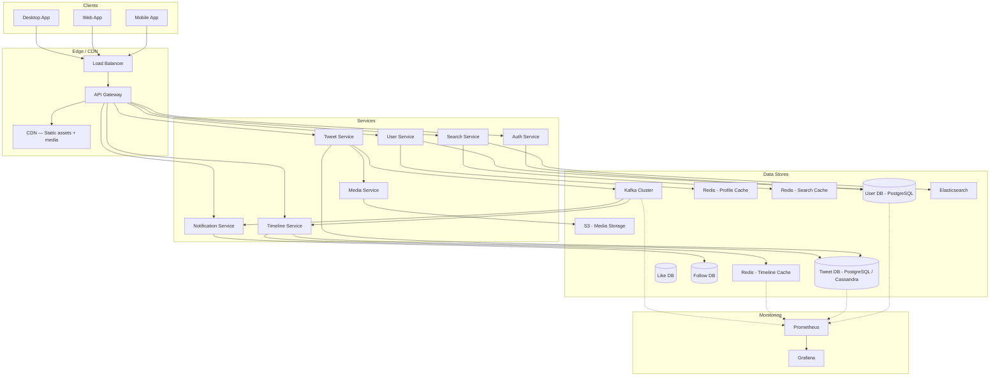

## Architecture Overview

Twitter is a **read-heavy, event-driven microservices architecture** with a hybrid push/pull fan-out model for timeline generation.

The system is split into two major architectural patterns:

1. **The Feed Pipeline (push + pull):** When a user posts, the tweet is pushed to followers' timeline caches. For super-nodes, tweets are pulled on read. This is the most critical and unique design challenge in Twitter.

2. **The Social Graph Pipeline:** Handles follows, user profiles, tweet metadata, likes, and notifications. This is a standard microservices architecture backed by sharded relational DBs, Redis caches, and a message bus.

### Key Design Decisions

**Decision 1: Hybrid Fan-Out (Push + Pull)**
- **Why not pure push?** A user with 10M followers would trigger 10M Redis writes per tweet. This is unsustainable.
- **Why not pure pull?** Every timeline read would require N DB queries (one per followed user). For a user following 3000 people, this is too slow.
- **Hybrid:** Push for users with < 1000 followers (99% of users). Pull for users with > 10000 followers (0.1% of users, but 50% of engagement). Hybrid zone gets batched fan-out.

**Decision 2: Timeline Cache per User (Redis)**
- **Why not store full tweet objects in Redis?** Too much memory. Instead, store only tweet IDs and small metadata snippets. Full tweet objects are fetched on-demand.
- **Why Redis?** Sub-millisecond reads, list operations (LPUSH/LRANGE) for timeline, TTL-based expiry for stale data.

**Decision 3: Event-Driven Architecture (Kafka)**
- **Why Kafka?** Fan-out on tweet creation, notification generation, and search indexing are all decoupled via events. This ensures scalability — Timeline Service and Notification Service operate independently.
- **Why not RabbitMQ?** Kafka provides ordered partitions, durability, and replayability — important for fan-out ordering.

**Decision 4: Database Sharding**
- **Why sharding?** 500M tweets/day × 200 bytes = 100GB/day writes to a single DB is infeasible. Sharding by `author_id` or `tweet_id` distributes writes across N nodes.
- **Why not NoSQL?** Relational DB (PostgreSQL) provides ACID for follow relationships and likes. NoSQL (Cassandra/DynamoDB) for tweet metadata where write throughput is paramount.

---

## Component Diagram

---

## Technology Choices

### Application Layer
| Component | Choice | Reason |
|-----------|--------|--------|
| API Gateway | NGINX / Kong | High-throughput reverse proxy, rate limiting, JWT validation |
| Service Framework | Go or Java (Spring Boot) | Go for high-concurrency services (Timeline, Tweet); Java for complex services (User, Search) |
| Communication | gRPC (internal) + REST/HTTP (external) | gRPC for low-latency inter-service calls; REST for client-facing APIs |

### Data Layer
| Component | Choice | Reason |
|-----------|--------|--------|
| User DB | PostgreSQL | Strong consistency for follow relationships, ACID compliance |
| Tweet DB | PostgreSQL (sharded) / Cassandra | Write-heavy workload; Cassandra for linear scalability |
| Like DB | PostgreSQL | Transactional integrity (user can like only once) |
| Follow DB | PostgreSQL with adjacency list | Graph-like queries; follow graph is not massive enough for a dedicated graph DB |
| Timeline Cache | Redis (Cluster Mode) | O(1) list operations, sub-ms reads, TTL expiry |
| Profile Cache | Redis (Hash) | Denormalized user profiles for fast reads |

### Messaging & Streaming
| Component | Choice | Reason |
|-----------|--------|--------|
| Event Bus | Apache Kafka | Ordered partitions, durability, replay, high throughput |
| Notification Queue | Kafka (same cluster) | Reuse Kafka; separate topics for different event types |

### Search
| Component | Choice | Reason |
|-----------|--------|--------|
| Search Engine | Elasticsearch | Full-text search, relevance ranking, hashtag support |

### Storage
| Component | Choice | Reason |
|-----------|--------|--------|
| Object Storage | AWS S3 | Image/video storage, durability, scalability |
| CDN | CloudFront | Media delivery, edge caching for static assets |

### Monitoring
| Component | Choice | Reason |
|-----------|--------|--------|
| Metrics | Prometheus + Grafana | Open-source, alerting, dashboards |
| Logging | ELK Stack (Elasticsearch, Logstash, Kibana) | Centralized log aggregation |
| Tracing | Jaeger or OpenTelemetry | Distributed tracing for latency debugging |
