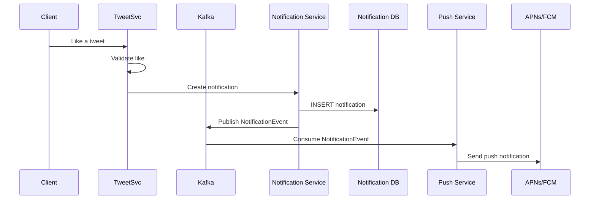
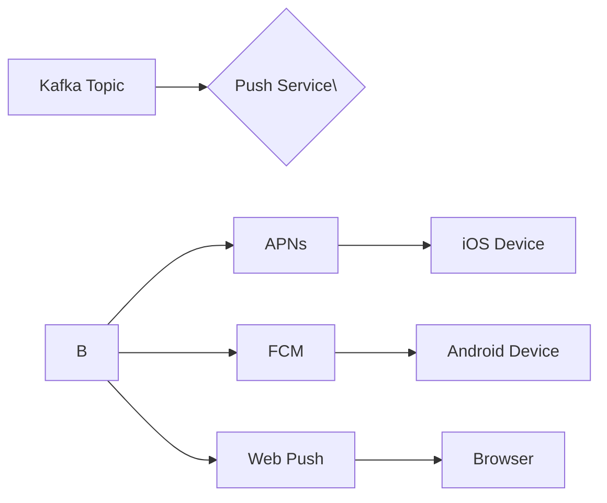

## Notification Events

### Event Taxonomy

Users receive notifications for five types of events:

| Event Type | Trigger | Recipient |
|------------|---------|-----------|
| LIKE | User A likes User B's tweet | User B (tweet author) |
| RETWEET | User A retweets User B's tweet | User B (tweet author) |
| FOLLOW | User A follows User B | User B (new follower) |
| REPLY | User A replies to User B's tweet | User B (original author or thread participants) |
| MENTION | User A mentions User B in a tweet | User B (mentioned user) |

### Event Volume

- Likes: ~2B/day → ~23k likes/sec
- Retweets: ~500M/day → ~5.8k retweets/sec
- Follows: ~50M/day → ~580 follows/sec
- Replies: ~500M/day → ~5.8k replies/sec
- Mentions: ~2B/day → ~23k mentions/sec

**Total: ~50k notification events/sec**

---

## Notification Pipeline

### Architecture



### Notification Service Design

```
Notification Service Workflow:

1. Receive event (like, retweet, mention, reply, follow)
2. Validate:
   - Does the recipient exist?
   - Is the recipient not muted/blocking the actor?
   - Has the recipient already received this notification (dedup)?
3. INSERT into Notification DB:
   \{recipient_id, actor_id, tweet_id, type, read=false, created_at\}
4. Publish event to Kafka for push delivery.
5. Return success.
```

### Notification DB Design

```sql
CREATE TABLE notifications (
    id BIGSERIAL PRIMARY KEY,
    recipient_id BIGINT NOT NULL,       -- Who gets notified
    actor_id BIGINT NOT NULL,           -- Who triggered the action
    tweet_id BIGINT,                    -- Related tweet (nullable for follow)
    type VARCHAR(20),                   -- LIKE, RETWEET, FOLLOW, REPLY, MENTION
    read BOOLEAN DEFAULT FALSE,
    created_at TIMESTAMP DEFAULT NOW()
);

-- Indexes
CREATE INDEX idx_recipient_created ON notifications (recipient_id, created_at DESC);
CREATE INDEX idx_read_created ON notifications (read, created_at DESC);
```

### Notification Deduplication

- **Retweets/Follows:** A user should only get one notification per action per actor. If User A retweets User B's tweet 10 times (different tweets), that's 10 notifications. But if User A retweets the same tweet 10 times (rate limit issue), deduplicate.
- **Likes:** One notification per like (even if User A likes 10 tweets by User B, that's 10 notifications — one per tweet).
- **Mentions:** One notification per mention tweet (even with multiple @mentions, the recipient only needs one notification per tweet).

---

## Push Delivery

### Push Notification Flow



### Platform-Specific Gateways

| Platform | Gateway | Notes |
|----------|---------|-------|
| iOS | Apple Push Notification Service (APNs) | Requires TLS, batched payloads |
| Android | Firebase Cloud Messaging (FCM) | Google's push service |
| Web | Web Push Protocol (VAPID) | Browser-based push |

### Push Payload Structure

```json
{
    "recipient_id": 12345,
    "device_tokens": ["token1", "token2"],
    "data": {
        "type": "like",
        "actor_id": 67890,
        "actor_username": "alice",
        "tweet_id": 111,
        "notification_id": 555
    },
    "title": "New like",
    "body": "@alice liked your tweet",
    "sound": "default",
    "badge": 1,
    "priority": "high"
}
```

### Push Best Practices

1. **Batch notifications:** Merge multiple notifications into one push (e.g., "alice, bob, and 12 others liked your tweets").
2. **Suppress duplicates:** If a user has 10 likes in the last 5 minutes, send ONE push: "10 new likes on your tweets."
3. **Throttle bursts:** Cap push notifications per user to prevent spam during viral moments.
4. **Silent push for metadata:** Update the in-app notification count silently; don't trigger a visible alert every time.

---

## Notification Scaling

### Database Sharding

Notifications are read-heavy (each user polls their own notification feed). Shard by `recipient_id`:

```
NOTIFICATION_DB.shardKey = recipient_id % NUM_SHARDS
```

**Shard count:** ~20 shards (one per 2.5M users).

### Read-Path Optimization

**Pattern 1: Notification list (paginated)**
```
GET /api/v1/notifications?limit=20&cursor=last_id
```
- Query: `SELECT * FROM notifications WHERE recipient_id = :id AND id < :cursor ORDER BY created_at DESC LIMIT 20`
- Result cached in Redis for 60s.

**Pattern 2: Unread count (the hot path)**
```
GET /api/v1/notifications/unread-count
```
- This endpoint is hit on EVERY app open (potentially every 5 minutes).
- **Solution:** Maintain a counter in Redis, incremented on each notification insert:
  ```
  redis.incr("unread_count:" + recipient_id)
  ```
- On fetch: `redis.get("unread_count:" + recipient_id)` then reset on read:
  ```
  redis.set("unread_count:" + recipient_id, 0)
  ```
- Periodically sync counter with DB to handle edge cases.

### Volume at Scale

**Write path:**
- 50k notification events/sec → 50k inserts/sec across 20 shards = 2.5k inserts/shard/sec
- Each shard handles ~2.5k writes/sec → very manageable for PostgreSQL.

**Read path (unread count):**
- ~100k/sec: most users check notifications less frequently.
- Redis handles this easily: ~100k reads/sec for counters.

### Notification Retention

Notifications are ephemeral — users typically check within hours.
- **Hot period:** 0-24 hours (stored in primary DB, cached in Redis)
- **Warm period:** 1-7 days (stored in primary DB, no cache)
- **Cold period:** 7+ days (archived to S3 / cold storage)

**Archival strategy:**
```sql
-- Move notifications older than 7 days to archive
INSERT INTO notifications_archive SELECT * FROM notifications WHERE created_at < NOW() - INTERVAL '7 days';
DELETE FROM notifications WHERE created_at < NOW() - INTERVAL '7 days';
```

**Storage after 7 days:**
- Archived in S3 (Parquet format for analytics).
- Primary DB holds ~7 days × 50M users × 2 notifications/user/day = ~700M notifications.
- At 200 bytes per notification = ~140GB. Manageable.
