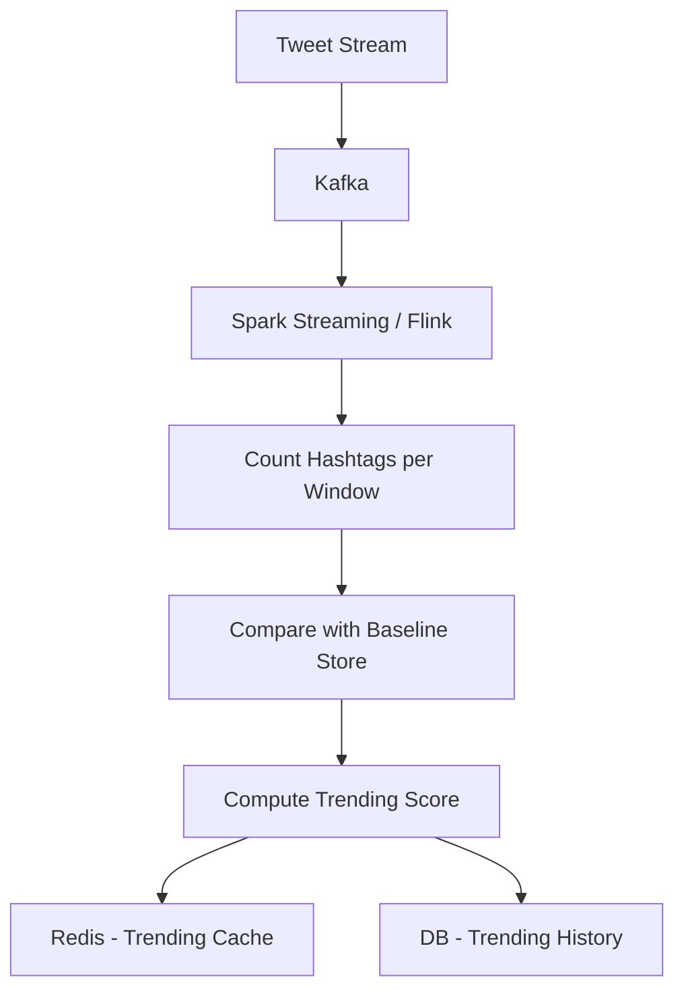

## Trending Problem Statement

### What Are "Trending Topics"?

Trending topics represent hashtags, keywords, or phrases that are experiencing a sudden spike in usage relative to their baseline. They surface on the Explore/discover page, not the home feed.

### Requirements

- **Real-time:** Trends should update every few minutes, not hours.
- **Time windows:** Support multiple windows: 1-hour (breaking news), 24-hour (popular topics).
- **Geographic personalization:** Trends should be localized by country/city.
- **Deduplication:** Avoid showing 10 variations of the same trend (e.g., "#BreakingNews" vs "#breaking_news" vs "breaking news").
- **Anti-manipulation:** Detect and suppress bot-driven trend campaigns.

### Scale

- Trending is a read-heavy feature: ~1B page views/day × 1 trend query per page = 1B queries/day.
- Trend computation runs periodically (every 5-10 minutes) across all hashtags.
- Volume of hashtags tracked: ~50M unique hashtags per hour.

---

## Trending Algorithm

### Core Idea: Spike Detection, Not Just Count

Raw count is misleading. "#Oscars" trending with 1M mentions during the ceremony is expected. "#Oscars" trending with 100 mentions on a random Tuesday is anomalous.

**Algorithm: Trending Score = (current_rate / baseline_rate)^weighted_by_velocity**

### Step-by-Step

```
1. Extract all hashtags from new tweets in the current window.
2. For each hashtag, compute:
   - current_count: number of tweets with this hashtag in the current window.
   - baseline_count: average count of this hashtag in the same time slot over the past N weeks.
   - velocity: rate of change (current_count - baseline_count) / baseline_count.

3. TrendingScore = max(velocity, 0) × log(current_count + 1)

4. Sort by TrendingScore DESC. Take top N per category (global, local, etc.).
```

### Why This Works

- **#GeneralTopic with 10M mentions:** baseline = 10M, velocity ≈ 0 → low score (expected activity).
- **#NewTopic with 50K mentions:** baseline ≈ 0, velocity = ∞ → very high score (breaking).
- **#SlowGrowingTopic with 1M mentions:** baseline = 100K, velocity = 9 → moderate score (steady rise).

---

## Sliding Window Aggregation

### The Data Flow



### Windowing Strategy

| Window | Duration | Purpose |
|--------|----------|---------|
| 1-hour | 60 minutes | Breaking news, fast-moving events |
| 24-hour | Rolling day | Overall popular topics |

**Implementation:**

```
// Every 5 minutes, compute trends for:
// - The past hour (rolling)
// - The past 24 hours (rolling)

// Data source: Kafka topic "tweet-hashtag-extractions"
// Each message: \{hashtag, timestamp, country, region\}

// Process with Apache Flink or Spark Streaming:
windowedCount = stream
    .filter(msg -> msg.hashtag)
    .window(TumblingWindows.time(60, MINUTES))
    .groupBy(msg -> msg.hashtag, msg.country)
    .count()
```

### Baseline Comparison

- Store hourly baselines per hashtag per country for the past 8 weeks.
- Baseline = median count for that hour across the past 4 weeks (to account for day-of-week patterns).
- Baseline store: Redis (fast lookup) or a small SQL DB (hashtags change weekly).

```
// Baseline store key
baseline_key = "baseline:\{hashtag\}:\{country\}:\{hour_of_day\}:\{day_of_week\}"
baseline_value = median(counts_over_4_weeks)

// Example: baseline for "#SuperBowl" on Sunday at 7 PM EST
// baseline_key = "baseline:SuperBowl:US:19:0"  // Sunday = 0
// baseline_value = 50000  // 50K mentions at this slot historically
```

---

## Data Structures for Trending

### Redis Sorted Set for Live Counts

```
// Key: "trending:live:\{country\}:\{window_minutes\}"
// Value: ZSET of hashtag -> count
// Updated every 5 minutes

// Example
ZINCRBY "trending:live:US:60" 150 "#BreakingNews"
ZINCRBY "trending:live:US:60" 89 "#GameNight"
// ...

// Get top 50
ZRANGEBYSCORE "trending:live:US:60" +inf -inf WITHSCORES LIMIT 0 50
```

### Baseline Store (PostgreSQL or Redis)

For speed, store baselines in Redis (hash):

```
// Key: "baseline:\{hashtag\}:\{country\}:\{slot\}"
// Value: int (median count over 4 weeks)

HSET baseline:BreakingNews:US:19:0 50000
HSET baseline:GameNight:US:22:0 20000
```

### Trending Score Cache

After computing scores, store results in Redis sorted sets:

```
// Key: "trending:score:\{country\}:\{window_minutes\}"
// Value: ZSET of hashtag -> score

ZADD "trending:score:US:60" 999 "#BreakingNews"
ZADD "trending:score:US:60" 850 "#GameNight"

// Fetch for client
ZRANGE "trending:score:US:60" 0 49 WITHSCORES
```

### De-duplication

Multiple hashtags often refer to the same topic:
- "#BreakingNews" vs "#breaking_news" vs "Breaking News"
- "#MVP" vs "#most_valuable_player"

**Approach:**
1. **Hash canonicalization:** Lowercase, remove underscores/hyphens, strip leading #.
2. **Semantic clustering (optional):** Use NLP (TF-IDF + cosine similarity) to group semantically related hashtags.
3. **Manual curation:** Editor-selected "related hashtags" for premium trends.

### Anti-Manipulation

Bot campaigns artificially inflate hashtags. Signals to detect:
- **New accounts:** Accounts < 30 days old posting the same hashtag at high frequency.
- **Bot patterns:** Automated posting (fixed intervals, identical text, same IP range).
- **Velocity anomalies:** Hashtag spike from a small subset of accounts in a short time.

**Mitigation:**
- Weight trending score by account age/followers.
- Cap contribution per account (e.g., max 5 hashtag mentions per hour count toward trending).
- Shadow-ban trending tags flagged by ML models.
