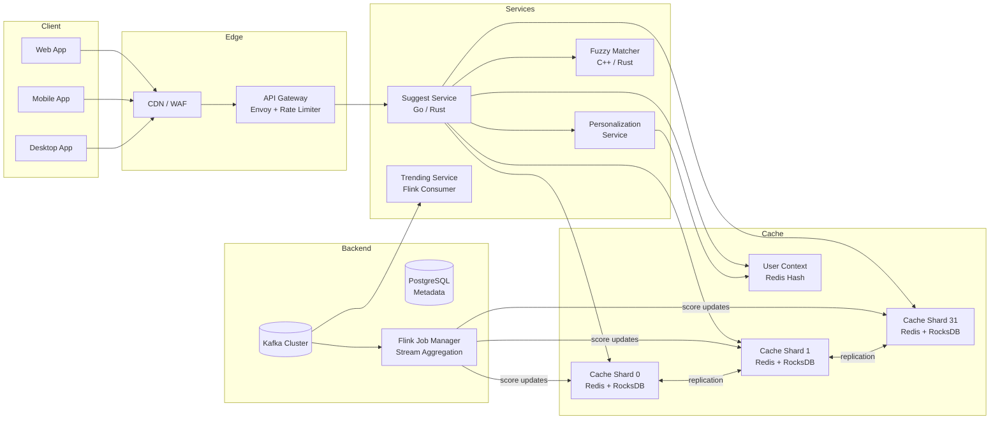

## Architecture Overview

The system uses an **in-memory cache-first architecture** where the prefix→terms dictionary lives entirely in RAM for sub-millisecond lookups. The core data structure is a **Radix Tree (Patricia Trie)** with top-k precomputation at each node, enabling O(k) lookup where k = query length.

### Design Decisions

1. **In-memory radix tree, not disk-based search.** Standard trie is too memory-heavy (256-way branching). Radix tree collapses single-child paths into edges, reducing node count by ~70%. Top-k results are precomputed at every node during dictionary build, so query = single tree descent with no post-processing.

2. **Sharded cache layer.** Prefix dictionary is sharded across N logical shards (N=32), each serving ~300M prefix entries. Sharding key: `hash(prefix) % N`. Each shard runs as a Redis Cluster with RocksDB engine (AOF persistence), multi-AZ replication.

3. **Personalization is post-retrieval.** Cache stores prefix→top-50 results (no user context). Personalization re-ranks in-memory after fetch. This keeps cache keys prefix-only, maximizing hit rate across users (~90%+ cache hit rate).

4. **Client-side debounce is the heaviest filter.** 30ms debounce + cancel in-flight requests on client. Server rate limiting (sliding window, Redis-backed) is a safety net.

5. **Fuzzy matching runs in parallel with deadline.** Three tiers (exact prefix, edit distance, phonetic) fire concurrently. Each tier has a 3ms deadline — results arriving late are dropped. This guarantees predictable p99 latency.

### Capacity Analysis

| Metric | Value |
|--------|-------|
| Distinct terms in dictionary | ~10 billion |
| Prefix entries after radix compression | ~300M nodes per shard |
| Memory per node (compressed) | ~90 bytes (10B edge label + 80B overhead) |
| Top-k at each node (k=50) | ~600 bytes (50 entries × 12B each) |
| Memory per shard | ~300M × 690B ≈ 207GB (RocksDB engine overhead ~20% → ~250GB) |
| Shard count | 32 (balanced for ~320M QPS total) |
| Nodes per shard | 4 (primary + 3 replicas) → 128 nodes total |
| QPS per shard node | ~78K (10M QPS / 128 nodes) |

> 10M QPS / 32 shards = ~312K QPS per shard. With 4 nodes per shard (HA), each node handles ~78K QPS — easily within Redis capacity (~100K ops/sec/core on 8 cores).

## Component Design

### API Gateway

- Entry point: TLS 1.3 termination, rate limiting (sliding window via Redis sorted set), request routing.
- Stateless: scales horizontally behind Envoy proxy.
- Rate limiting: token bucket in API Gateway (Redis-backed), 5 req/s per IP anonymous, 20 req/s per user authenticated.
- Circuit breaker: trips after 3 consecutive slow responses (>15ms) from any backend service.

### Suggest Service

Core suggestion pipeline. Request flows through:

1. **Rate limit check** — Redis-backed token bucket, reject 429 if over quota
2. **Cache lookup** — Multi-get across relevant shards (consistent hash ring), fetch prefix→top-50 raw results
3. **Fuzzy expansion** (optional) — If prefix results < 5, launch edit-distance + phonetic parallel queries with 3ms deadline
4. **Personalization re-rank** — Load user context from Redis, compute weighted score, sort
5. **Category deduplication** — Ensure no duplicate terms across categories (history, global, trending)
6. **Truncate to top-k** — Return top 10 with metadata

```
Request → [Rate Limit] → [Cache Lookup] → (if < 5 results) → [Fuzzy Expansion]
                                        ↓
                              [Personalization] → [Dedup] → [Truncate] → Response
```

### Personalization Service

- Loads user context from Redis: `user:\{id\}:context` (last 20 queries, location, device, language)
- Re-ranks 50 results: `final_score = 0.45 * global_score + 0.25 * history_affinity + 0.20 * location_boost + 0.05 * device_tuning + 0.05 * recency_boost`
- Weights are starting values, tuned per-tenant via A/B testing and learning-to-rank models (LambdaMART)
- Latency: ~1ms for in-memory sort of 50 items

### Trending Service

- Consumes `autocomplete-events` Kafka topic
- Computes per-term query velocity (queries/minute) with 60-second commit interval
- Z-score spike detection: flag if velocity > mean + 3σ over 7-day rolling baseline
- Trending terms promoted to `category=TRENDING` with `boost_factor = 1 + z_score / 10`
- Trending cache: `trending:\{country\}:\{time_window\}` — updated every 60 seconds
- Term expiration: 24h of silence → auto-expires (background aging scan)

### Fuzzy Matcher Service

- In-memory C++/Rust service with SIMD-optimized edit distance
- Three-tier: exact prefix (always runs) + edit distance ≤ 2 + phonetic (both fire in parallel, 3ms deadline)
- Results arriving after 3ms deadline are silently dropped — guarantees bounded p99 latency
- Damerau-Levenshtein distance supports transpositions (common in typos: "gogle" → "google")
- Results merged and deduplicated: same term from multiple tiers keeps highest score

## Architecture Diagram



## Scaling Strategy

| Component | Method | Capacity per Node | Total |
|-----------|--------|-------------------|-------|
| API Gateway | Horizontal (Envoy) | 50K RPS | Scales to demand |
| Suggest Service | Horizontal | 10K QPS | 10 nodes → 100K QPS |
| Cache Shards | 32 logical shards × 4 replicas | 200K ops/sec | 128 nodes |
| Personalization | Stateless, co-located | 50K req/s | 4 nodes |
| Fuzzy Matcher | Stateless | 100K queries/s | 4 nodes |
| Kafka | Partitioned (12 partitions) | 50K msgs/sec/partition | 600K msgs/sec total |
| Flink | 1 Job Manager + workers | Depends on throughput | Auto-scaling |

## Availability and Fault Tolerance

| Failure Scenario | Response | Recovery |
|-----------------|----------|----------|
| Single cache shard down | Request routes to next consistent hash neighbor; user sees fewer suggestions (no error) | RocksDB replay ~30s |
| Cache shard slow (>15ms p99) | Circuit breaker trips → request routed to neighbor (+5ms latency) | Automatic after 3 consecutive slow responses |
| All cache shards saturated | API Gateway enforces rate limiting; authenticated users get priority (20 req/s vs 5 req/s) | Sustained throttling until load drops |
| Fuzzy Matcher failure | Fuzzy tiers skipped; returns prefix-only results | Service restart, fallback to prefix cache |
| Kafka outage | Dictionary builder pauses; stale scores served from cache | Automatic partition rebalance on recovery |
| Personalization service failure | Returns global-ranked results (no personalization) | Graceful degradation |

## Scaling per Region

For global deployment, replicate the entire stack per region (US-East, EU-West, APAC):
- Each region handles ~60% of traffic (regional locality for trending)
- Cross-region sync for dictionary updates (async, eventual consistency)
- Client routed to nearest region via DNS geolocation
- If a region is down, traffic fails over to second-nearest region (~50ms added latency)

## Health Check

- `/health`: Liveness — 200 if process alive.
- `/ready`: Readiness — 200 if cache shards + all backends reachable; 503 if not. Partial cache failure degrades gracefully.
- Suggest Service exposes `cache_hit_rate` and `p99_latency_ms` as Prometheus metrics for auto-scaling triggers.
