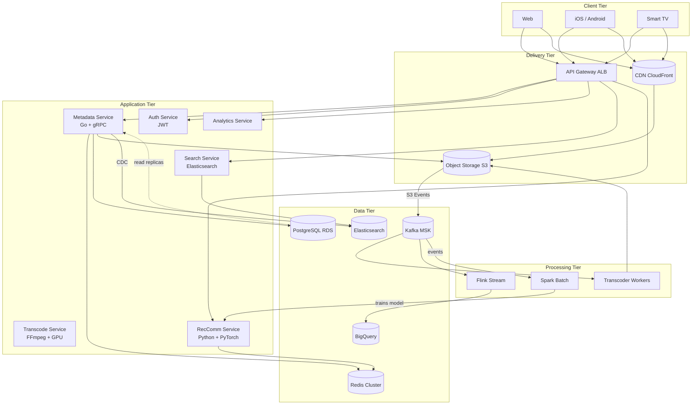

## Architecture Overview

The system uses a layered microservices architecture with CDN offloading for media delivery.

**Key design decisions:**
- **CDN-first delivery**: Video segments bypass all application servers. CDN is the highest throughput path.
- **Async processing**: Upload → transcoding is fully async via Kafka. Users see a "processing" state while transcodes run.
- **Cache-first reads**: Hot video metadata lives in Redis. Cold reads fall back to the primary database.
- **Two-stage recommendations**: Wide recall (batch model) + precise ranking (real-time features) keeps latency under 100ms.
- **Region-local resources**: Each region has its own CDN edges, Redis, and DB replicas. Cross-region replication for durability.

**Throughput analysis:**
- 10M concurrent streams x 3 Mbps avg = 30 Tbps aggregate throughput → CDN handles this
- 500 hrs/min = 3.6M videos/day = 42 ops/sec upload ingestion → Kafka absorbs burst
- 2B users, 100K:1 read:write = ~2M read QPS for metadata → Redis cache covers 95%+

## Component Diagram

## Technology Choices

| Component | Choice | Why |
|-----------|--------|-----|
| CDN | CloudFront / Cloudflare | Global edge network, HLS/DASH native support, signed URL auth |
| Object Storage | AWS S3 / GCS | Durable (99.999999999%), cheap, presigned URL uploads |
| API Gateway | AWS ALB + App Runner | Auto-scaling, TLS termination, health checks |
| Metadata Service | Go (gRPC + HTTP/2) | High concurrency, low latency, small memory footprint |
| Transcoding | FFmpeg on GPU instances (g5.xlarge) | Industry standard encoder, GPU accelerates H.265/VP9 |
| Stream Processing | Apache Kafka + Flink | Exactly-once semantics, handles burst ingestion, fault tolerant |
| Caching | Redis Cluster | Sub-millisecond reads, sorted sets for ranking, high availability |
| Database | PostgreSQL (RDS) | ACID for metadata, JSONB for flexible fields, read replicas |
| Search | Elasticsearch | Full-text search, faceted filtering, geo/duration range queries |
| Recommendations | Python (PyTorch) + Redis | Rich ML ecosystem, candidate storage in Redis for serving |
| Analytics Warehouse | BigQuery | Serverless, petabyte-scale, integrates with ML pipelines |
| Monitoring | Prometheus + Grafana | Cloud-native, Kubernetes compatible, alerting |
| Deployment | Kubernetes (EKS) | Auto-scaling, rolling deployments, multi-region orchestration |
