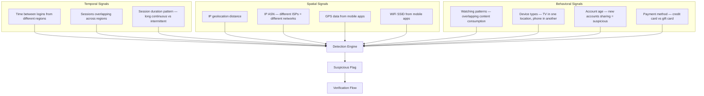
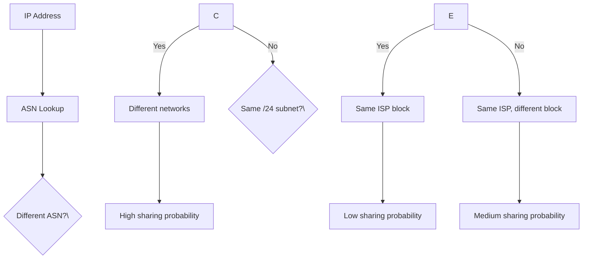
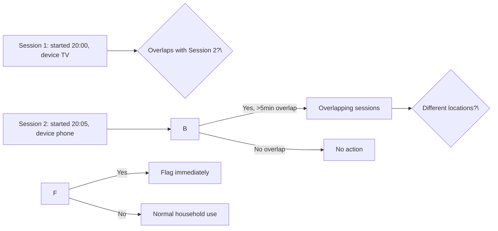
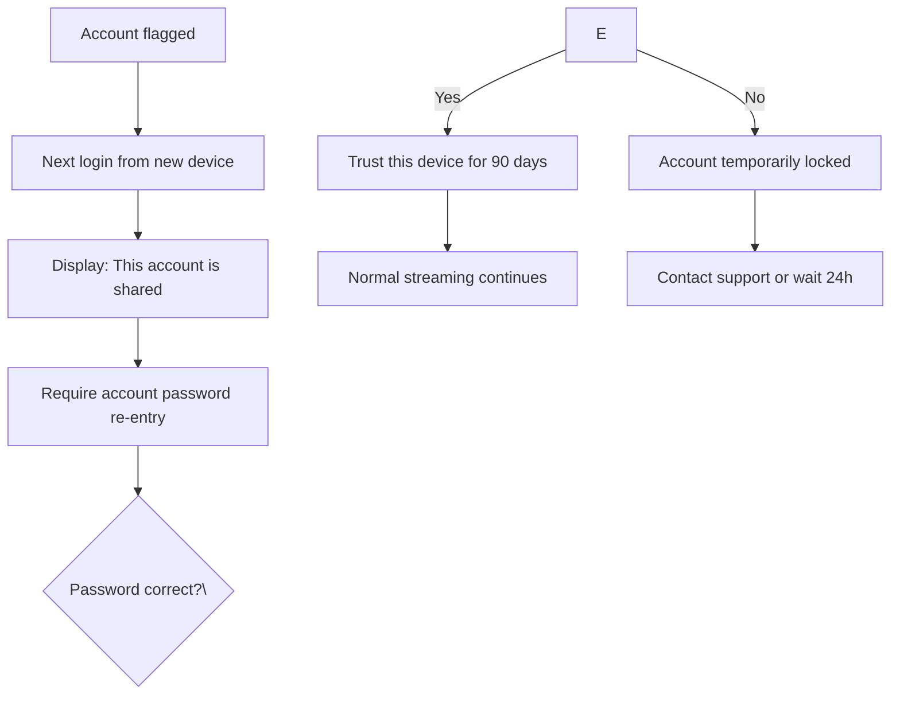

## Detection Criteria

### The Problem Statement

Netflix's business model penalizes account sharing, but users naturally share passwords within households. The challenge is distinguishing between:

- **Legitimate household sharing** — family members using the account from the same location
- **Credential sharing** — giving your password to someone in a different city/country
- **Account piracy** — selling your password to strangers

The system must flag the second category without creating false positives on the first.

### Detection Signals



### Scoring System

Each signal contributes a weighted score. When the total exceeds a threshold, the account is flagged:

| Signal | Weight | Rationale |
|--------|--------|-----------|
| Sessions from different IP ASNs simultaneously | +40 | Strongest signal — same password, different ISPs |
| Sessions from different countries overlapping | +35 | Impossible travel window |
| Sessions from same household (same WiFi SSID) | -30 | Normalizes household sharing |
| Sessions from same IP range (same /24) | -20 | Same building/network, likely household |
| GPS from mobile apps same location | -25 | Strong negative signal |
| Account age < 30 days | +10 | New accounts are more likely to be shared |
| Gift card payment | +10 | Higher fraud correlation |
| TV + phone simultaneously | +15 | Different device classes = likely different people |

**Threshold**: Flag if score &gt;= 50. This means one strong signal (different ASNs simultaneously) triggers a flag, or two moderate signals combine.

## Algorithm Design

### Real-Time Detection Pipeline

```mermaid
sequenceDiagram
    participant K as Kafka (stream events)
    participant C as Consumer
    participant G as Geo Engine
    participant I as IP Index
    participant S as Scorer
    participant F as Flag Store

    K->>C: stream.session_started events
    C->>I: GET ip_asn:\{ip\}
    I-->>C: AS number + country
    C->>G: GET geo:\{user_id\}:\{device_id\}
    G-->>C: \{lat, lon, country\}
    C->>S: Run scoring algorithm
    S->>F: Set flag:\{user_id\}=\{score\} EXPIRE 3600
    alt Score &gt;= 50
        S->>F: HSET suspicious:\{user_id\} \{timestamp\}
        F-->>S: Flagged
    end
```

The geo engine maintains a sliding window of active sessions per user. For each new session_started event, it checks:

1. Are there overlapping sessions from different IP ASNs?
2. Are any sessions from different countries with overlapping timestamps?
3. Is there GPS/SSID data that contradicts the IP-based geolocation?

### IP Network Clustering



IP ASN (Autonomous System Number) is the most reliable single signal because:

- Two devices on different ISPs (e.g., Comcast vs Verizon) cannot physically be in the same household
- Two devices on the same ISP but different /24 subnets are likely in different buildings
- Two devices on the same /24 subnet might be in the same apartment building but not the same household

### Time-Overlap Detection



A 5-minute overlap threshold is used because:

- 0 minutes: Too strict — a user might briefly watch on TV, then switch to phone
- 5 minutes: Captures genuine simultaneous use (e.g., one person watching a show, another checking notifications)
- 15 minutes: Too loose — would miss short-term sharing detection

## Verification Flow

### The User Experience

When an account is flagged, the system doesn't block anyone. Instead, it triggers a verification flow:



The verification flow only triggers on the **most recently added device**, not on existing active sessions. This minimizes disruption:

- Existing users (household members) continue watching
- The new user (sharing suspect) must re-authenticate
- If they can't, they either: (a) don't get access, or (b) must contact the account owner

### Device Trust Tokens

After successful re-verification, a trust token is issued:

```
trust:\{user_id\}:\{device_id\} = "verified"
EXPIRE trust:\{user_id\}:\{device_id\} 7776000  # 90 days in seconds
```

This prevents re-flagging the same device for 90 days. The token is stored in Redis and checked during the scoring phase.

### False Positive Recovery

If a user is incorrectly flagged (e.g., traveling, or legitimately sharing with a friend):

1. The account owner receives an email with a link to "manage sharing"
2. The owner can confirm or deny the flag
3. If confirmed as legitimate, the flag is dismissed and the score decreases by 50 points
4. The device is added to a "trusted devices" list

This puts the decision in the hands of the account holder rather than an automated system.
