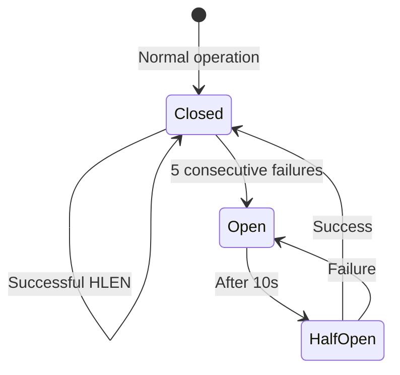

## Fallback Chain

### Four-Tier Fallback Strategy

The device limit check is in the playback hot path. Any failure must be handled gracefully without blocking content delivery.

```mermaid
flowchart TD
    A[Playback authorization request] --> B\{Redis connection?\}
    B -->|Yes| C\{HLEN succeeded?\}
    B -->|No| D[Tier 3: In-memory fallback]

    C -->|Yes, count < limit| E[Tier 1: Allow normally]
    C -->|Yes, count &gt;= limit| F[Tier 1: Deny normally]
    C -->|No| G[Tier 2: Last-known DB value]

    G --> H\{DB readable?\}
    H -->|Yes| I[Tier 2: Read from DB]
    H -->|No| D

    D --> J[Tier 3: In-memory last-known per user]
    J --> K\{In-memory cache?\}
    K -->|Yes| L[Tier 3: Use cached count]
    K -->|No| M[Tier 4: Allow (fail open)]

    style E fill:#c8e6c9
    style F fill:#c8e6c9
    style L fill:#fff9c4
    style M fill:#ffcdd2
```

| Tier | Behavior | Latency | Impact | When Activated |
|------|----------|---------|--------|----------------|
| 1 | Normal Redis path | < 2ms | None | Healthy operation |
| 2 | Read last count from User Service DB | 10-50ms | Stale count possible | Redis cluster failure |
| 3 | In-memory last-known count per user | < 1ms | May miss recent changes | Redis + DB failure |
| 4 | **Allow playback (fail open)** | < 1ms | False positives possible | Total system outage |

### Why "Fail Open" in Tier 4?

When the entire device limit system is down, the choice is between:

- **Fail closed**: Return 429 to all requests → 50M users can't watch → catastrophic
- **Fail open**: Allow all requests → slightly more streams than allowed → acceptable

A few hundred extra streams is far better than blocking 50 million paying subscribers. The revenue loss from extra streams (if any) is negligible compared to the churn from a blocked playback.

## Circuit Breaker Per Component

### Three Independent Circuit Breakers



Each component has its own circuit breaker with tailored thresholds:

| Component | Failure Count | Window | Open Duration | Probe Command |
|-----------|--------------|--------|---------------|---------------|
| **Redis** | 5 | 60s | 10s | `PING` |
| **User Service (plan lookup)** | 3 | 30s | 5s | `GetPlan(user_id)` |
| **Kafka (event publish)** | 10 | 60s | 30s | `Produce test message` |

### Redis Circuit Breaker Behavior

When the Redis circuit breaker opens:

1. The next 10 requests for any user immediately fall to Tier 2 (read from User Service DB)
2. Every 10 seconds, a single `PING` probe is sent to Redis
3. If `PING` succeeds, one real `HLEN` test is attempted
4. If the test succeeds, the circuit breaker closes and normal operation resumes
5. If the probe fails, the breaker stays open for another 10 seconds

### User Service Circuit Breaker Behavior

When the plan lookup circuit breaker opens:

1. The in-memory plan cache (1-hour TTL, Kafka-driven invalidation) becomes the sole source of truth
2. Since the cache hit rate is 99%, this only affects new users and users who changed plans in the last hour
3. If the cache also doesn't have the plan, the default is `PREMIUM` (max 4 streams) — fail open on plan uncertainty

## Degradation Modes

### Three Degradation Levels

```mermaid
flowchart TB
    subgraph Normal["Normal Mode"]
        N1[Full Redis path]
        N2[Plan lookup via cache + fallback]
        N3[Event publishing to Kafka]
    end

    subgraph Degraded["Redis Degraded"]
        D1[Plan lookup from DB]
        D2[Events buffered locally]
        D3[HLEN from cache]
    end

    subgraph Critical["System Down"]
        C1[Fail open: allow all]
        C2[Cache-only plan lookup]
        C3[Events lost (no Kafka)]
    end

    Normal -->|"Redis failover"| Degraded
    Degraded -->|"Full outage"| Critical
    Critical -->|"Recovery"| Normal
```

#### Degraded Mode: Redis Under Stress

**Trigger:** Redis p99 latency > 50ms for 30 seconds or circuit breaker trips.

**Behavior:**
- Plan lookups fall to User Service DB (5-50ms vs < 1ms cached)
- Stream count falls to in-memory last-known cache (per-user counter maintained locally)
- Kafka events are buffered locally (up to 100K in-process) and retried when Redis recovers
- The in-memory stream count is eventually consistent — may allow 1-2 extra streams per user temporarily

#### Critical Mode: Total Outage

**Trigger:** Redis, User Service DB, and Kafka all unavailable.

**Behavior:**
- All requests are allowed (fail open)
- Plan lookup uses in-memory cache only — new users default to PREMIUM
- No events are recorded — gap in analytics for the outage duration
- Engineering page is triggered automatically
- Dashboard shows real-time outage map by region

### Recovery Monitoring

After recovery, the system doesn't immediately return to full capacity. Instead:

1. Redis circuit breaker closes after 3 consecutive successful `PING`s
2. Stream count validation runs: compare in-memory count against Redis for a random 1% sample of users
3. If counts match within 0.1% tolerance, drain the in-memory buffer and stop Kafka event replay
4. If counts diverge > 1%, continue in degraded mode for another 5 minutes
5. Full health dashboard updates within 1 minute of recovery
