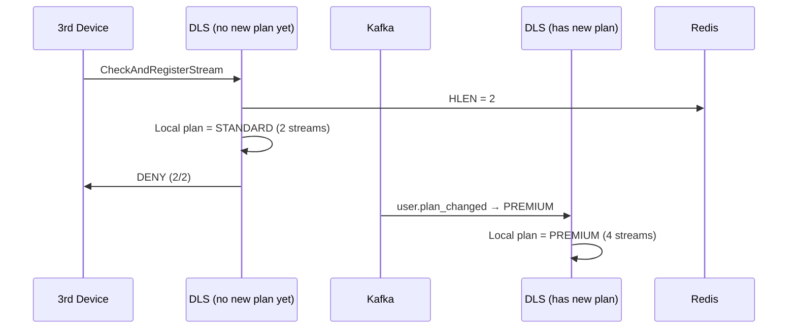
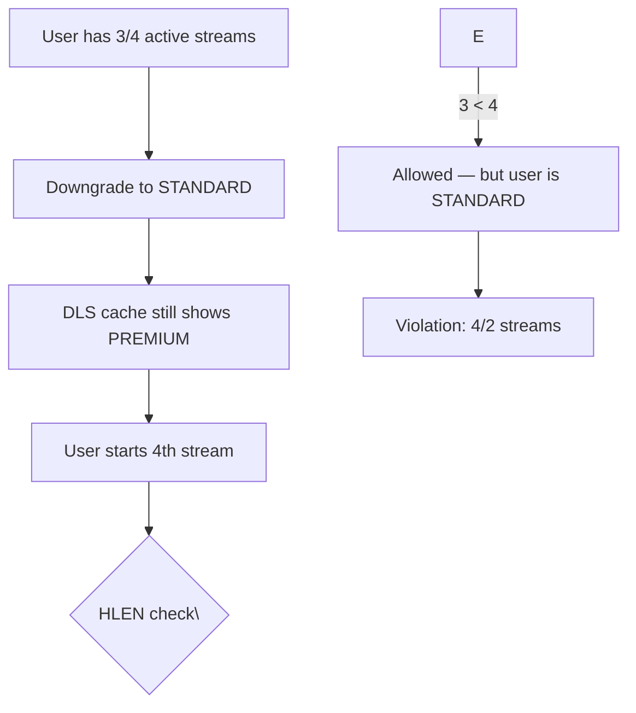

## Event Flow

### The Plan Change Lifecycle

```mermaid
sequenceDiagram
    participant U as User Service
    participant K as Kafka
    participant D as DLS Instance 1
    participant E as DLS Instance 2
    participant N as DLS Instance N
    participant R as Redis (stream state)

    U->>K: user.plan_changed \{user_id, old_plan, new_plan\}
    K->>D: Consume event
    K->>E: Consume event
    K->>N: Consume event

    D->>D: Update in-memory plan cache
    E->>E: Update in-memory plan cache
    N->>N: Update in-memory plan cache

    Note over D,E,N: All instances update within ~100ms
```

When a user changes plans:

1. User Service persists the change to its database
2. User Service publishes `user.plan_changed` to Kafka
3. All DLS instances consume the event and update their local in-memory plan cache
4. The next stream authorization for that user uses the new limit

### Event Schema

```json
{
  "event_id": "evt-plan456",
  "event_type": "user.plan_changed",
  "timestamp": "2026-05-03T20:05:00Z",
  "user_id": "usr_abc123",
  "old_plan_type": "STANDARD",
  "new_plan_type": "PREMIUM",
  "old_max_streams": 2,
  "new_max_streams": 4
}
```

The event includes both old and new values so that DLS instances can validate the transition without cross-referencing the User Service.

### Propagation Latency

| Stage | Latency |
|-------|---------|
| User Service → Kafka | < 10ms |
| Kafka → DLS consume | < 50ms |
| DLS in-memory update | < 0.01ms |
| **Total end-to-end** | **< 60ms** |

A plan upgrade is visible to all DLS instances within 60ms of the user clicking "upgrade." This means the user can start streaming on a higher plan essentially immediately — no waiting for a refresh cycle or manual cache invalidation.

## Cache Invalidation

### Cache Key Design

```
plan:\{user_id\} → {
    "plan_type": "PREMIUM",
    "max_streams": 4,
    "updated_at": "2026-05-03T20:05:00Z",
    "cache_key_version": 3
}
```

The `cache_key_version` field is the critical part. It changes every time the plan for this user changes.

### Invalidating via Event-Driven Updates

The in-memory cache doesn't use a time-based TTL for invalidation. Instead, it uses event-driven updates:

```python
def handle_plan_changed(event):
    user_id = event.user_id
    new_plan = event.new_plan_type
    new_version = get_next_version()

    # Atomic update
    plan_cache[user_id] = {
        "plan_type": new_plan,
        "max_streams": get_max_streams(new_plan),
        "updated_at": event.timestamp,
        "cache_key_version": new_version,
    }
```

This eliminates the need for:

- Background TTL expiry checks (reduces CPU usage)
- Cache stampede protection (every update is immediate)
- Stale read windows (the event is the source of truth)

### Handling Missed Events

If a DLS instance misses a `user.plan_changed` event (e.g., during a rebalance):

1. The in-memory cache has a fallback: check the User Service on cache miss or on TTL expiry (1 hour)
2. If the User Service has a newer plan version, the DLS instance detects the version mismatch and updates
3. A reconciliation process runs every hour, comparing local cache versions against a snapshot from User Service

This gives us **at-least-once** guarantees with eventual consistency. Missed events are rare and self-healing.

## Race Condition Handling

### The Upgrade Race

Consider this scenario:

1. User upgrades from STANDARD (2 streams) to PREMIUM (4 streams) at 20:05:00
2. The user already has 2 active streams on different devices
3. At 20:05:01, a 3rd stream starts before all DLS instances have received the plan change event



The 3rd device gets denied because the DLS instance that handled the request hadn't received the plan change event yet. This is a known limitation of the event-driven cache.

### Mitigation: Plan Cache Warmup

To reduce this race window:

1. **Kafka consumer parallelism**: Each DLS instance runs multiple consumer threads, processing events concurrently
2. **Event buffering**: Events are buffered in a local queue (in-process, 1K events) and flushed to cache immediately
3. **Proactive invalidation**: When User Service receives a plan change request, it updates a Redis key `plan_version:\{user_id\}` before publishing the Kafka event. DLS instances poll this key with a 1-second interval as a fallback

### The Downgrade Race

A more dangerous scenario:

1. User downgrades from PREMIUM (4 streams) to STANDARD (2 streams)
2. The user has 3 active streams already
3. DLS instance still has the old plan (PREMIUM) in cache
4. User tries to start a 4th stream



This is a **false negative** (allowing more streams than the plan allows). It's less severe than blocking a real user (false positive), but it does represent revenue loss.

### Mitigation: Cache TTL as Safety Net

Even with event-driven invalidation, the in-memory plan cache still has a 1-hour TTL as a safety net:

- The downgrade race is limited to a 1-hour window
- In practice, the Kafka event arrives within 60ms, so the race window is milliseconds, not hours
- The 1-hour TTL only matters for the rare case of missed events
- Revenue impact: a user downgrading and keeping 4 streams for 1 hour is negligible

### Summary: Race Condition Analysis

| Race | Direction | Impact | Mitigation |
|------|-----------|--------|------------|
| Upgrade before event delivery | Allow fewer than allowed | User inconvenience (blocked briefly) | 1-second Redis poll fallback |
| Downgrade after event delivery | Allow more than allowed | Revenue loss (minor) | Event-driven + 1h TTL safety net |
| Duplicate plan change event | N/A | No impact (idempotent update) | N/A |
| Missed plan change event | Stale plan | Depends on direction | 1h TTL + hourly reconciliation |
