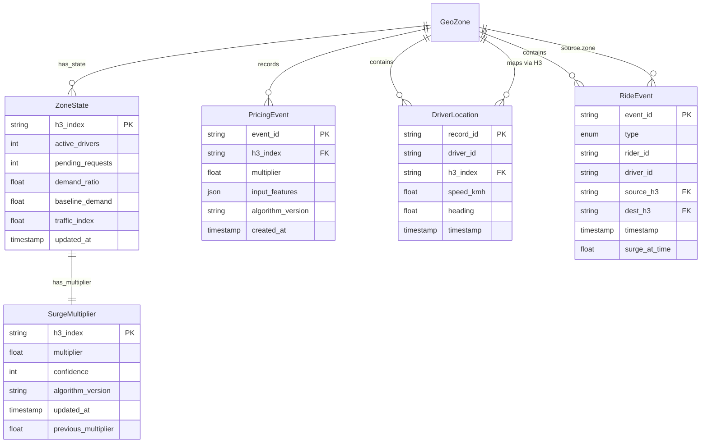

## Entity Definitions

### GeoZone

The fundamental pricing unit. Represents a hexagonal grid cell (H3 index) used for supply-demand aggregation.

| Field | Type | Description |
|-------|------|-------------|
| `h3_index` | string (H3) | Primary key, ~1km² hexagonal cell |
| `city_id` | string | Parent city identifier |
| `is_active` | bool | Whether zone is in pricing calculation scope |

### ZoneState

Real-time supply-demand state for a geo zone. Updated by the stream processor.

| Field | Type | Description |
|-------|------|-------------|
| `h3_index` | string (H3) | Primary key |
| `active_drivers` | int | Drivers currently in zone and available |
| `pending_requests` | int | Unfulfilled ride requests in zone |
| `demand_ratio` | float | pending_requests / active_drivers (ratio) |
| `baseline_demand` | float | Historical average demand for this time slot |
| `traffic_index` | float | Congestion level (0.0–1.0) |
| `updated_at` | timestamp | Last state update |

### SurgeMultiplier

Computed surge multiplier per zone. The output of the pricing engine.

| Field | Type | Description |
|-------|------|-------------|
| `h3_index` | string (H3) | Primary key |
| `multiplier` | float | Surge multiplier (1.0–4.0) |
| `confidence` | int | 0–100 confidence score |
| `algorithm_version` | string | ID of pricing model used |
| `updated_at` | timestamp | Last calculation time |
| `previous_multiplier` | float | Previous value (for oscillation check) |

### PricingEvent

Immutable record of each surge calculation. Used for auditing and analytics.

| Field | Type | Description |
|-------|------|-------------|
| `event_id` | UUID | Primary key |
| `h3_index` | string | Zone identifier |
| `multiplier` | float | Computed multiplier |
| `input_features` | JSON | Feature values at calculation time |
| `algorithm_version` | string | Model version |
| `created_at` | timestamp | Calculation timestamp |

### RideEvent

Each ride lifecycle event (request, pickup, drop-off).

| Field | Type | Description |
|-------|------|-------------|
| `event_id` | UUID | Primary key |
| `type` | enum | REQUEST, PICKUP, DROP_OFF |
| `rider_id` | string (nullable) | Rider who placed the request |
| `driver_id` | string (nullable) | Driver who accepted |
| `source_h3` | string | Origin zone |
| `dest_h3` | string (nullable) | Destination zone |
| `timestamp` | timestamp | Event time |
| `surge_at_time` | float | Surge multiplier at event time |

### DriverLocation

Continuous GPS position from drivers.

| Field | Type | Description |
|-------|------|-------------|
| `record_id` | UUID | Primary key |
| `driver_id` | string | Driver identifier |
| `h3_index` | string | Current zone (from GPS) |
| `speed_kmh` | float | Vehicle speed |
| `heading` | float | Direction in degrees |
| `timestamp` | timestamp | GPS timestamp |

## Relationships

### ER Diagram

### Entity Interaction Flow

1. **GPS stream**: Driver sends location → H3 lookup → update `ZoneState.active_drivers`
2. **Ride request**: Rider requests ride → H3 lookup → increment `ZoneState.pending_requests`
3. **Ride pickup**: Driver accepts → decrement pending, mark driver as occupied
4. **Ride drop-off**: Driver completes → mark driver as available again
5. **Pricing calculation**: Every 60s per zone → read `ZoneState` → compute `SurgeMultiplier` → store + emit event
