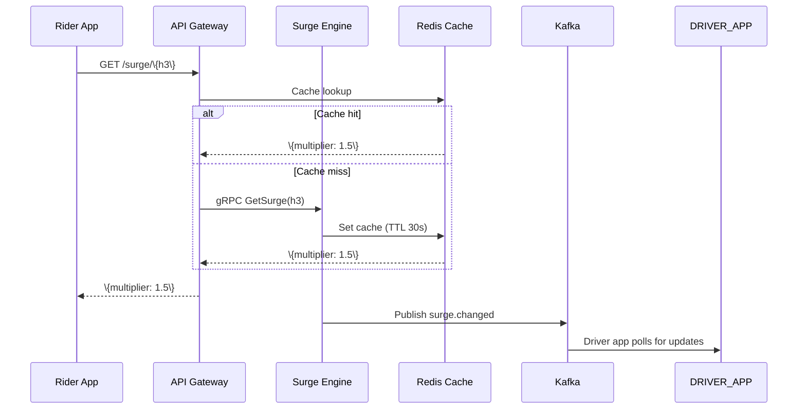

## REST API

All API paths are prefixed with `/api/v1`. Auth via internal service token (mTLS).

### Surge Lookup

| Method | Path | Description |
|--------|------|-------------|
| GET | `/surge/\{h3_index\}` | Get current surge multiplier for a zone |
| GET | `/surge/batch` | Get multipliers for multiple zones |
| GET | `/surge/history/\{h3_index\}` | Get surge history for a zone |

**Get Current Surge:**
```json
GET /api/v1/surge/891f1d73fff8fff
{
  "h3_index": "891f1d73fff8fff",
  "multiplier": 1.5,
  "confidence": 87,
  "algorithm_version": "v2.3.1",
  "updated_at": "2026-05-03T14:32:00Z"
}
```

**Batch Lookup:**
```json
GET /api/v1/surge/batch?h3=891f1d73fff8fff&h3=891f1d73ffff8&h3=891f1d77fff8fff
[
  \{"h3_index": "891f1d73fff8fff", "multiplier": 1.5, "confidence": 87\},
  \{"h3_index": "891f1d73ffff8", "multiplier": 1.0, "confidence": 92\},
  \{"h3_index": "891f1d77fff8fff", "multiplier": 2.0, "confidence": 78\}
]
```

### Surge Calculation Control

| Method | Path | Description |
|--------|------|-------------|
| POST | `/surge/calculate` | Trigger immediate calculation for a zone |
| PUT | `/surge/config` | Update pricing algorithm configuration |
| GET | `/surge/config` | Get current pricing config |
| POST | `/surge/deploy` | Deploy new algorithm version |

### Analytics

| Method | Path | Description |
|--------|------|-------------|
| GET | `/surge/analytics/revenue` | Revenue impact by zone/time range |
| GET | `/surge/analytics/elasticity` | Demand elasticity per zone |
| GET | `/surge/analytics/ab-test` | A/B test results |

### Health

| Method | Path | Description |
|--------|------|-------------|
| GET | `/health` | Health check |
| GET | `/metrics` | Prometheus metrics |

## gRPC Interface

Internal service communication for event ingestion and surge broadcast.

```protobuf
service SurgeEngine {
  // Ingest ride lifecycle events
  rpc IngestRideEvent(RideEvent) returns (EventReceipt);
  // Ingest driver location updates
  rpc IngestDriverLocation(DriverLocation) returns (EventReceipt);
  // Get current surge for a zone
  rpc GetSurge(SurgeRequest) returns (SurgeResponse);
  // Subscribe to surge updates for a set of zones
  rpc SubscribeSurge(SubscribeRequest) returns (stream SurgeUpdate);
}

message RideEvent {
  string event_id = 1;
  EventType type = 2;          // REQUEST, PICKUP, DROP_OFF
  string rider_id = 3;
  string driver_id = 4;
  string source_h3 = 5;
  string dest_h3 = 6;
  int64 timestamp = 7;
  float surge_at_time = 8;
}

message DriverLocation {
  string record_id = 1;
  string driver_id = 2;
  string h3_index = 3;
  float speed_kmh = 4;
  float heading = 5;
  int64 timestamp = 6;
}

message SurgeRequest {
  string h3_index = 1;
}

message SurgeResponse {
  string h3_index = 1;
  float multiplier = 2;
  int32 confidence = 3;
  string algorithm_version = 4;
  int64 updated_at = 5;
}

message SubscribeRequest {
  repeated string h3_indices = 1;
}

message SurgeUpdate {
  string h3_index = 1;
  float multiplier = 2;
  float previous_multiplier = 3;
  int32 confidence = 4;
  int64 updated_at = 5;
}

enum EventType {
  REQUEST = 0;
  PICKUP = 1;
  DROP_OFF = 2;
}

message EventReceipt {
  string event_id = 1;
  bool acknowledged = 2;
}
```

### Surge Broadcasting (gRPC Stream)



## Event Bus

### Topics

| Topic | Published By | Consumed By |
|-------|-------------|-------------|
| `driver.location` | Driver SDK | Stream processor (ZoneState updater) |
| `ride.request` | Matching service | Stream processor, analytics |
| `ride.pickup` | Matching service | Stream processor (supply release) |
| `ride.drop_off` | Matching service | Stream processor (supply release) |
| `zone.state.updated` | Stream processor | Surge calculator |
| `surge.calculated` | Surge calculator | Cache invalidation, analytics |
| `surge.changed` | Surge calculator | Rider app (WebSocket push), driver app |

### Message Format

```json
{
  "event_id": "evt-abc123",
  "event_type": "surge.calculated",
  "timestamp": "2026-05-03T14:32:00Z",
  "h3_index": "891f1d73fff8fff",
  "multiplier": 1.5,
  "previous_multiplier": 1.0,
  "confidence": 87,
  "algorithm_version": "v2.3.1",
  "input_features": {
    "active_drivers": 25,
    "pending_requests": 38,
    "demand_ratio": 1.52,
    "baseline_demand": 30,
    "traffic_index": 0.65
  }
}
```
