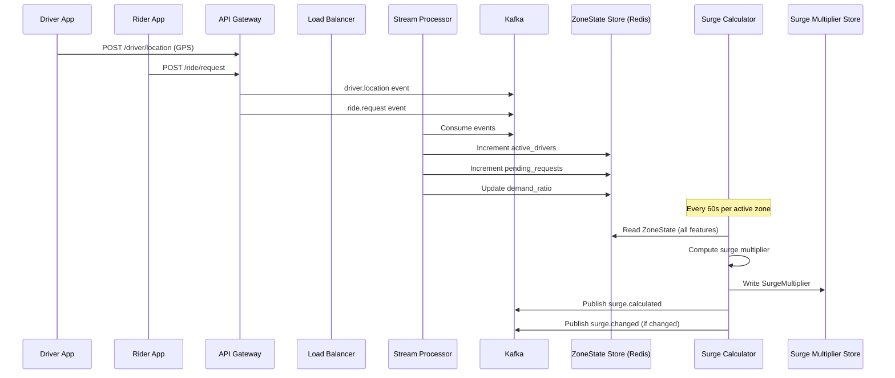
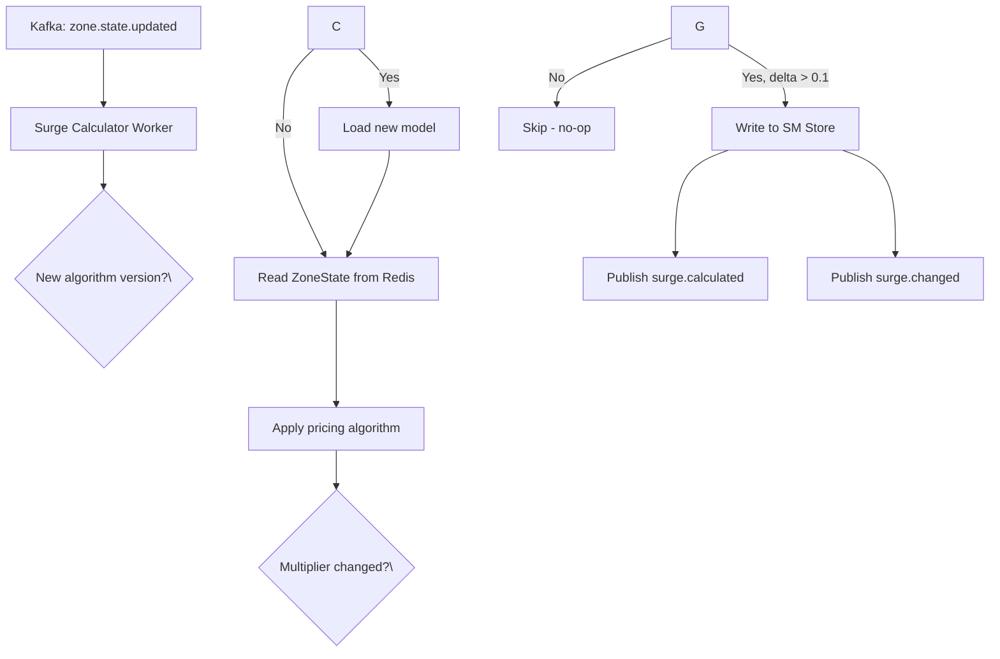
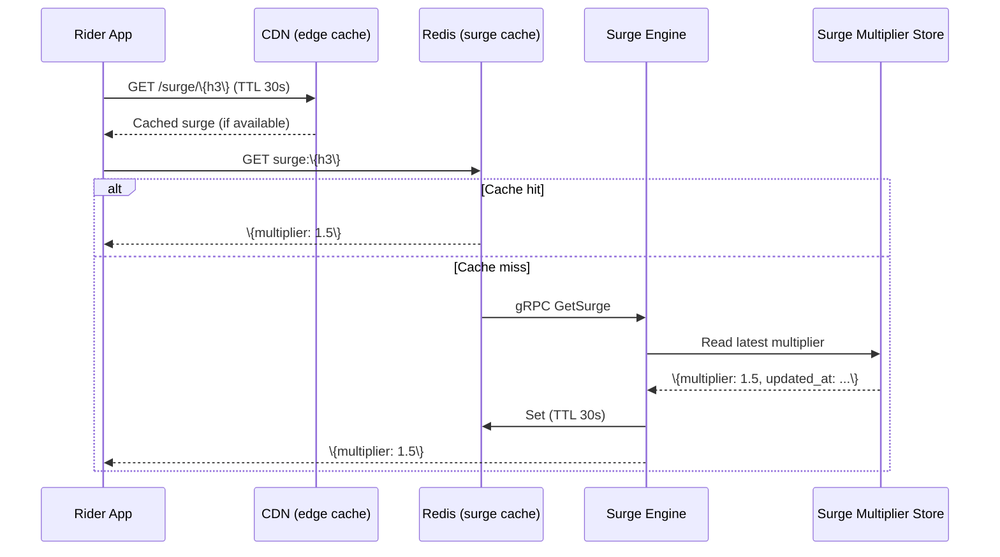
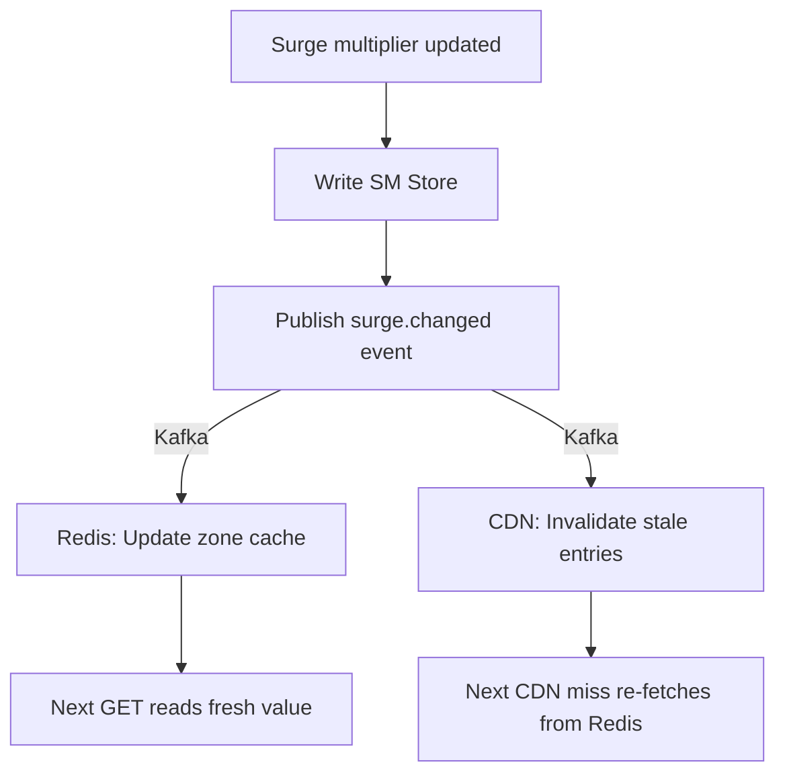
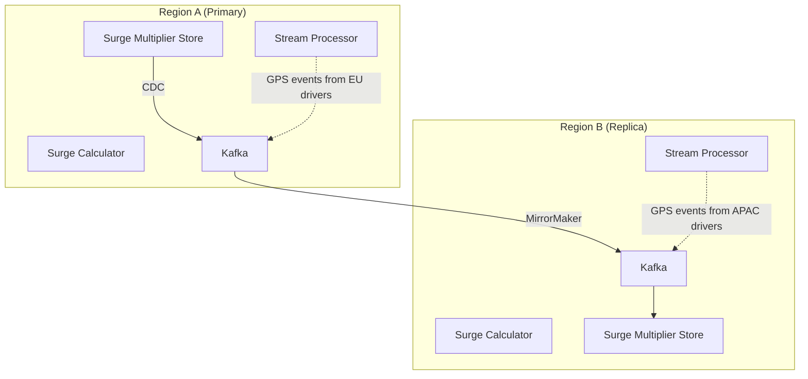

## Write Path

### Event Ingestion Write Path



1. Driver sends GPS data, rider sends ride request → API gateway → Kafka.
2. Stream processor reads events, updates `ZoneState` in Redis.
3. Every 60 seconds, the surge calculator reads the latest `ZoneState` for each active zone.
4. Calculator applies the pricing algorithm → produces `SurgeMultiplier`.
5. If multiplier changed > 0.1x from previous, publish `surge.changed` to Kafka.

### Surge Calculation Write Path (Per Zone)



## Read Path

### Rider App Surge Lookup



1. Rider app requests surge for zone → checks edge CDN first (30s TTL).
2. If not on CDN, check Redis zone-level cache.
3. On cache miss, query the surge multiplier store for latest value.
4. Cache result in Redis (30s) and CDN (30s) for subsequent requests.

### Historical Surge Query

```mermaid
flowchart LR
    A[GET /surge/history/\{h3\}?range=24h] --> B[Query ClickHouse]
    B --> C[Aggregate: avg, max, min multiplier]
    C --> D[Return chart data]
```

- ClickHouse (columnar) stores all `PricingEvent` records.
- Pre-aggregated by hour for fast chart rendering.

## Sync/Replication Flow

### Cache Consistency Pattern



### Regional Data Flow



- Each region computes its own surge multipliers from local GPS events.
- Multiplier store is replicated to replicas for read redundancy.
- Cross-region failover: replica region promotes its local calculator if primary is down.
