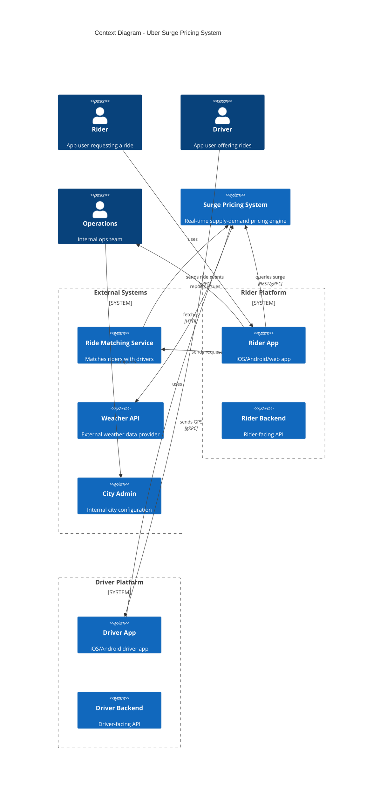
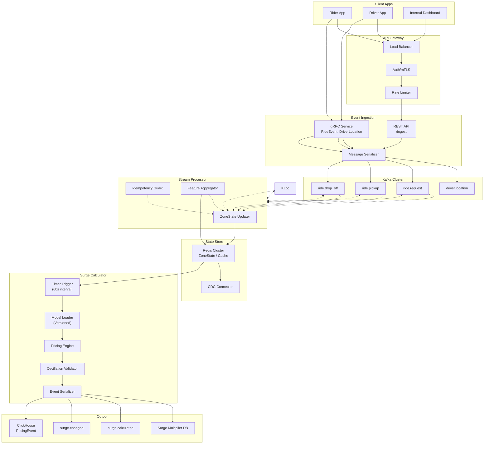
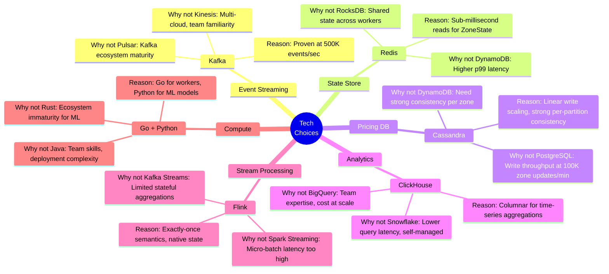

## Architecture Overview

### System Architecture Overview



The surge pricing system sits at the intersection of three data planes: **driver supply streaming**, **rider demand ingestion**, and **pricing computation**. The architecture is designed around a zone-centric model where every pricing decision is scoped to an H3 hexagonal grid cell.

```mermaid
blockLR
    blockIngestion["Event Ingestion Layer"]
        GW["API Gateway\n(Nginx/Envoy)"]
        gRPC["gRPC Services\n(IngestRideEvent, IngestDriverLocation)"]
        gateway_down --> gRPC
    end

    blockStream["Stream Processing Layer"]
        Kafka["Kafka Cluster"]
        SP["Stream Processor\n(Flink/ksqlDB)"]
        kafka_down --> SP
    end

    blockState["State & Storage Layer"]
        Redis["Redis Cluster\n(ZoneState + Cache)"]
        SM["Surge Multiplier Store\n(Cassandra/DynamoDB)"]
        ClickHouse["ClickHouse\n(PricingEvent + Analytics)"]
    end

    blockCompute["Pricing Compute Layer"]
        Calculator["Surge Calculator\n(Worker Pool)"]
        algo["Pricing Algorithm\n(Model Registry)"]
    end

    gRPC_down --> Kafka
    SP --> Redis
    SP --> Kafka
    SP_down --> ClickHouse
    Calculator --> Redis
    Calculator_down --> SM
    Calculator --> algo
```

**Key architectural decisions:**

1. **Zone-centric, not trip-centric.** The system operates at H3 zone granularity rather than per-trip or per-driver granularity. This dramatically reduces state cardinality (100K zones vs billions of trip pairs) and enables batch-friendly computation.

2. **Lambda-style streaming + caching.** The streaming path (Kafka → Flink → Redis) provides real-time zone state updates. The cache layer (CDN → Redis → DB) provides low-latency reads. The calculation path (Redis → Calculator → SM) runs on a fixed interval, decoupling read latency from compute latency.

3. **Event sourcing for pricing.** Every pricing decision is recorded as an immutable `PricingEvent` in ClickHouse. This provides an audit trail, enables post-hoc analysis, and makes algorithm rollbacks possible by replaying events.

## Component Diagram

### Component Breakdown



### Component Responsibilities

| Component | Responsibility | Technology |
|-----------|---------------|------------|
| **API Gateway** | Request routing, auth, rate limiting | Envoy/Nginx |
| **gRPC Service** | High-throughput event ingestion | Go/gRPC |
| **Kafka Cluster** | Event buffering, ordering per partition | Apache Kafka |
| **Stream Processor** | Real-time zone state aggregation | Apache Flink |
| **ZoneState Updater** | Increment/decrement counters per zone | Flink stateful function |
| **Idempotency Guard** | Deduplicate events using event_id | Flink checkpoint |
| **Surge Calculator** | Periodic pricing computation | Go/Python workers |
| **Model Loader** | Load versioned pricing models | Model registry |
| **Pricing Engine** | Execute algorithm with feature inputs | Algorithm library |
| **Oscillation Validator** | Enforce monotonic change constraints | Guard rail |
| **Surge Multiplier DB** | Persist latest multiplier per zone | Cassandra/DynamoDB |
| **ClickHouse** | Event sourcing + analytics | ClickHouse |

## Technology Choices

### Technology Selection Rationale



### Detailed Comparison

#### Event Streaming: Kafka vs Pulsar vs Kinesis

| Criteria | Kafka | Pulsar | Kinesis | Decision |
|----------|-------|--------|---------|----------|
| Throughput | 500K+ msg/s | 500K+ msg/s | 1M msg/s (sharded) | **Kafka** |
| Multi-region | MirrorMaker 2 | Native bookies | No | - |
| Consumer Lag | Well-understood | Complex | Simple | - |
| Team Familiarity | High | Medium | Low | - |

Kafka was chosen because the team has deep operational experience with it, and the throughput requirement (500K events/sec) is well within its single-cluster capacity. Pulsar's storage-compute separation is attractive but introduces operational complexity for a problem Kafka solves adequately.

#### State Store: Redis vs DynamoDB vs RocksDB

| Criteria | Redis | DynamoDB | RocksDB | Decision |
|----------|-------|----------|---------|----------|
| Read Latency | < 0.5ms | 10-50ms | < 1ms (local) | **Redis** |
| Shared State | Yes | Yes | No (per-node) | - |
| Persistence | AOF/RDB | Native | N/A | - |
| Operations | Simple | Serverless | Manual | - |

Redis provides sub-millisecond reads for ZoneState, which is critical since the Stream Processor reads/writes zone state on every event. RocksDB is local-only and can't share state across processor instances. DynamoDB's 10-50ms p99 is an order of magnitude slower.

#### Pricing DB: Cassandra vs PostgreSQL vs DynamoDB

| Criteria | Cassandra | PostgreSQL | DynamoDB | Decision |
|----------|-----------|------------|----------|----------|
| Write Throughput | 100K+/sec | 10K/sec | 10K/sec (unpartitioned) | **Cassandra** |
| Strong Consistency | Per-write | Strong | Strong | - |
| Multi-Region | Built-in | Cross-replica | Global Tables | - |
| Query Flexibility | Limited | Rich | Limited | - |

Cassandra handles 100K zone updates/minute (1.7K/sec) with strong per-write consistency and linear write scaling. PostgreSQL can't sustain the write volume. DynamoDB is a contender but Cassandra's mature multi-region replication is preferred for our failover requirements.

#### Analytics: ClickHouse vs Snowflake vs BigQuery

| Criteria | ClickHouse | Snowflake | BigQuery | Decision |
|----------|------------|-----------|----------|----------|
| Query Latency | 100ms | 1-5s | 1-10s | **ClickHouse** |
| Data Ingestion | High throughput | Medium | High | - |
| Cost | Self-managed | Per-credit | Per-slot | - |
| Team Expertise | High | Medium | Medium | - |

ClickHouse's columnar engine delivers sub-second queries over billions of PricingEvent records. Snowflake and BigQuery introduce 1-10s latencies that make real-time operational dashboards impractical. Self-managed ClickHouse also offers better cost predictability at 90-day retention.

#### Stream Processing: Flink vs Spark vs Kafka Streams

| Criteria | Flink | Spark Streaming | Kafka Streams | Decision |
|----------|-------|-----------------|---------------|----------|
| Latency | ~100ms | ~1s (micro-batch) | ~100ms | **Flink** |
| Exactly-Once | Native | With checkpoint | At-least-once | - |
| State Management | Built-in | External | RocksDB | - |
| Complexity | Medium | High | Low | - |

Flink provides native exactly-once semantics with stateful processing, which is critical for idempotent event processing. Spark's micro-batch approach introduces too much latency for our 5-second p99 calculation requirement. Kafka Streams lacks the sophisticated stateful aggregation capabilities needed for ZoneState maintenance.
