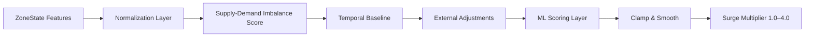
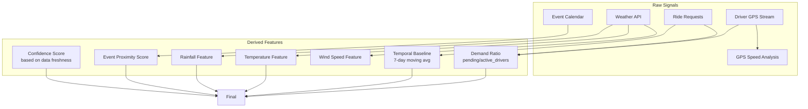
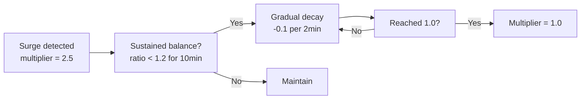
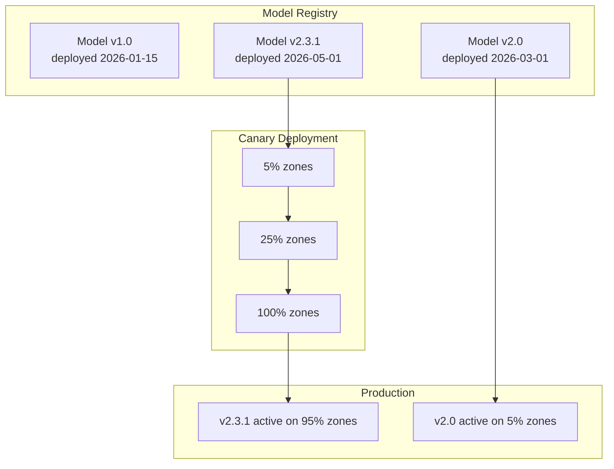

## Algorithm Design

### Pricing Function Design



The surge pricing function maps multiple input features to a single multiplier in [1.0, 4.0]. The design combines a rule-based supply-demand ratio with an ML model that adjusts for temporal patterns and external factors.

#### Base Rule: Supply-Demand Ratio

```
demand_ratio = pending_requests / active_drivers

base_multiplier = 1.0 + (demand_ratio - 1.0) * 0.5
```

This rule is linear and simple, which means:
- At equilibrium (ratio = 1.0), multiplier = 1.0 (base price)
- At 2x demand/supply, multiplier = 1.5x
- At 4x demand/supply, multiplier = 2.5x
- At 6x demand/supply, multiplier = 4.0 (cap reached)

**Why linear instead of exponential?** Linear is predictable and explainable. An exponential curve would produce violent surges during extreme demand spikes (e.g., 8x → 5.0x before capping), which causes rider backlash. A linear ramp lets us increase price proportionally to imbalance, then let the ML model add nuance.

#### ML Adjustment Layer

```
final_multiplier = clamp(base_multiplier + ml_adjustment, 1.0, 4.0)
```

The ML model produces an adjustment in the range [-0.5, +1.5], conditioned on:
- Historical demand patterns (day-of-week, hour-of-day)
- Weather conditions (rain increases baseline demand)
- Traffic congestion (slower pickups → effective supply reduction)
- Special events (concerts, sports, holidays)

The model is a **gradient-boosted decision tree** (LightGBM) because:
- It handles mixed feature types (categorical + continuous) naturally
- It produces interpretable feature importance scores (required for regulatory compliance)
- It's faster than neural networks at inference time (~1ms vs ~10ms), critical for a 60-second calculation cadence

#### Why LightGBM over alternatives?

| Model | Inference Time | Feature Types | Interpretability | Training Speed |
|-------|---------------|---------------|------------------|----------------|
| LightGBM | ~1ms | Mixed | High (SHAP) | Fast |
| XGBoost | ~2ms | Mixed | High | Medium |
| Linear Regression | &lt;0.5ms | Continuous only | High | Fast |
| Neural Net | ~10ms | Mixed | Low | Slow |

LightGBM wins because we need **all four**: fast inference (100K zones/minute), mixed feature support, interpretability for regulatory compliance, and fast retraining for algorithm iteration.

## Feature Engineering

### Feature Pipeline



### Feature Store Schema

Each feature is stored with a timestamped value per zone:

| Feature Group | Features | TTL | Update Rate |
|---------------|----------|-----|-------------|
| **Real-time** | `active_drivers`, `pending_requests`, `demand_ratio` | 60s | Event-driven |
| **Semi-real-time** | `traffic_index`, `gps_speed_avg` | 5min | Aggregated |
| **Temporal baseline** | `baseline_demand` (7-day moving avg) | 24h | Batch |
| **External** | `temperature`, `precipitation`, `wind_speed` | 1h | API poll |
| **Event** | `event_proximity_score` | 24h | Daily batch |
| **Confidence** | `data_freshness_score` | 60s | Computed |

**Why separate real-time from external features?** Real-time features (driver locations, ride requests) arrive via the streaming pipeline and are already in Redis. External features (weather, events) are pulled on-demand by the calculator. This separation avoids coupling the calculator to external API latency during the critical pricing computation path.

### Confidence Score Design

The confidence score (0–100) measures how much we trust the current ZoneState:

```
confidence = min(100, 100 * (active_drivers + pending_requests) / expected_minimum)
```

Where `expected_minimum` is the 10th-percentile of (active_drivers + pending_requests) for this time-of-day over the past 30 days. When very few events arrive in a zone (e.g., rural area at 3am), confidence drops and the model leans on the temporal baseline rather than the current ratio.

This prevents spurious surge spikes in zones with low traffic volumes where a single rider request can artificially spike the demand_ratio from 0 to 10.

## Oscillation Prevention

### Oscillation Problem

Without controls, surge multipliers can oscillate:
1. Demand increases → multiplier rises to 2.0x
2. Higher price reduces rider demand → ratio drops
3. Calculator sees reduced demand → drops to 1.5x
4. Lower price attracts riders → demand increases again
5. Repeat back to step 1

This creates a **limit cycle** that's worse than doing nothing.

### Solution: Hysteresis + Rate Limiting

#### Hysteresis Band

A change only takes effect if it exceeds a threshold from the previous value:

```
if abs(new_multiplier - old_multiplier) < 0.1:
    skip update (use previous value)
```

The 0.1 threshold means small fluctuations (e.g., 1.48 → 1.52) are silently ignored. This prevents micro-adjustments that riders would notice.

#### Rate Limiting

A multiplier change is bounded per 5-minute window:

```
max_change_per_5min = 0.5
new_multiplier = clamp(new_multiplier, old - 0.5, old + 0.5)
```

This ensures that even during extreme demand changes, the multiplier can only move by 0.5x per 5-minute window. It takes 4 windows (20 minutes) to go from 1.0x to 4.0x, which is gradual enough for riders to adapt.

#### Decay Mechanism

After a surge event, the multiplier should smoothly return to 1.0:



**Why gradual decay instead of instant reset?** A sudden drop from 2.5x to 1.0x signals poor prediction quality to riders and can trigger the opposite oscillation (drivers leaving because they suddenly see lower earnings). Gradual decay maintains trust in the pricing system.

## Model Versioning

### Version Management



### Version Lifecycle

| Stage | Zones | Duration | Rollback Trigger |
|-------|-------|----------|------------------|
| **Dev** | Internal test zones | N/A | Any metric regression |
| **Canary-5%** | 5% of active zones | 24-48h | p95 revenue per driver drops >2% |
| **Canary-25%** | 25% of zones | 24h | Any A/B test significance loss |
| **Rollout-100%** | 100% of zones | Continuous | Circuit breaker triggered |
| **Retired** | Archived | 7 days | N/A |

### Rollback Procedure

Rollback is instant:

1. Operator clicks "rollback" in internal dashboard
2. Model registry switches `current_version` pointer back to previous version
3. All calculator workers pick up the new version on next 60s tick
4. Within 60 seconds, all zones are running on the previous model

**Why pointer-based versioning instead of canary rollback?** The model registry holds a single `current_version` reference per city. Changing it triggers a Kafka notification that calculator workers subscribe to. Since workers reload models at the start of each calculation cycle (60s), the entire system switches in one cycle — no need for gradual rollback.
