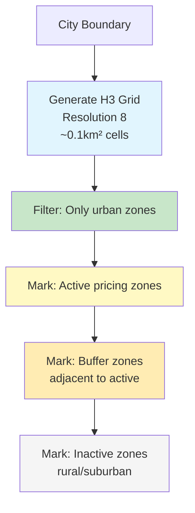
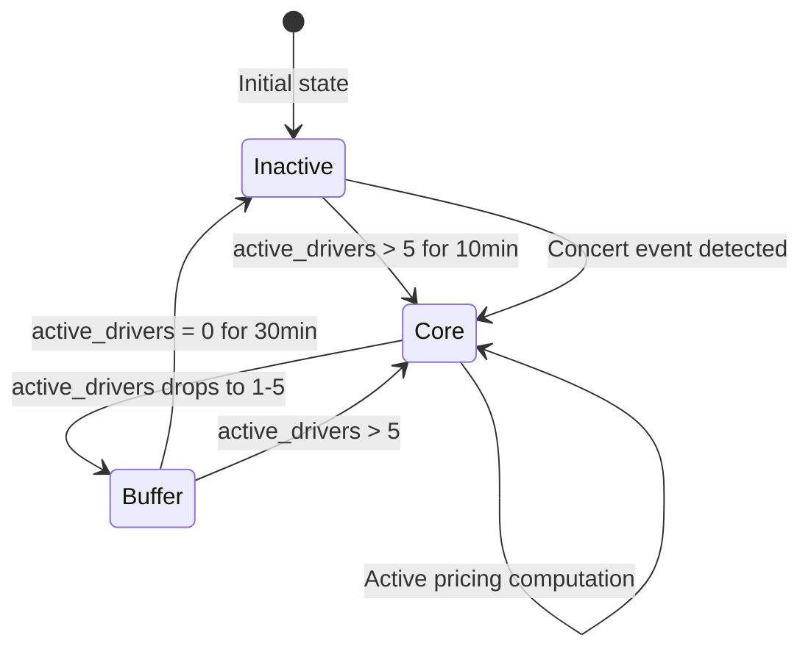
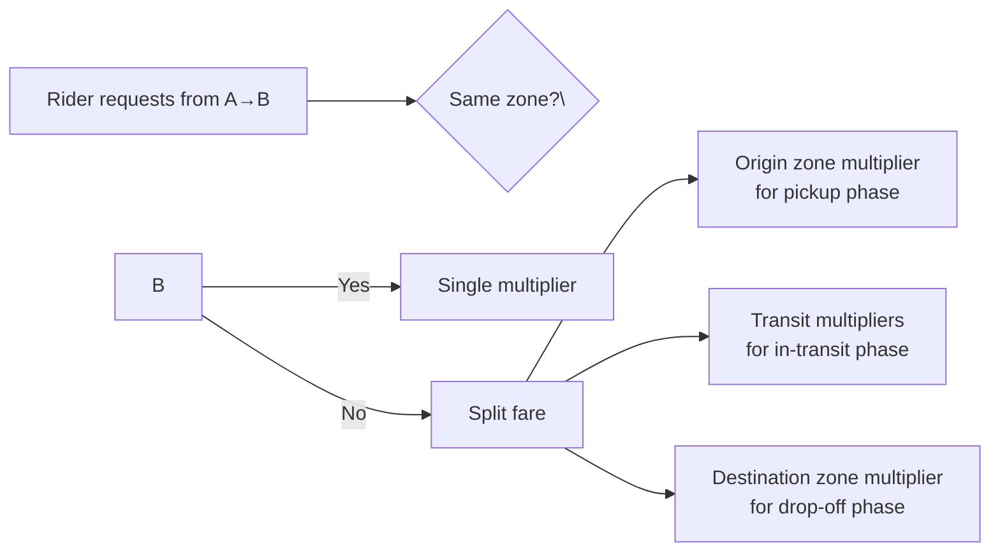
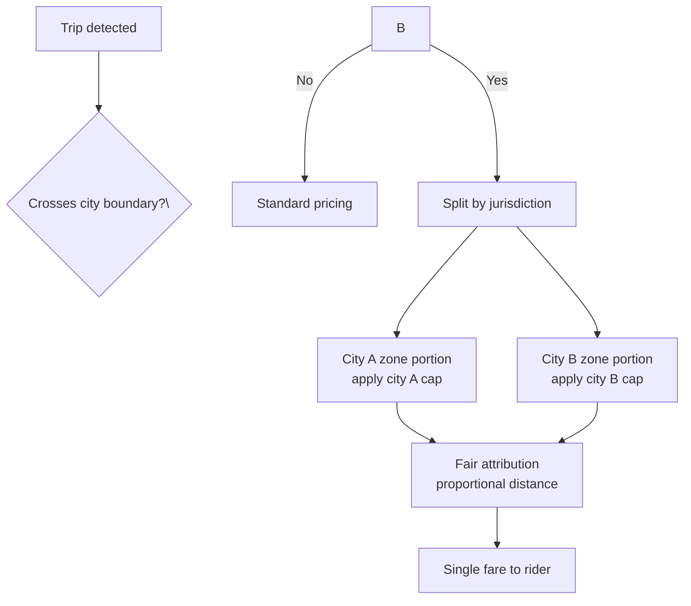

## Boundary Definition

### H3 Hexagonal Grid System



H3 is a hexagonal hierarchical spatial index by Uber Engineering. We use Resolution 8 hexagons (~0.1km²), which provides:
- Fine enough granularity to capture local supply-demand dynamics
- Coarse enough aggregation that individual events don't create volatile zone-level metrics
- Natural adjacency relationships for neighbor lookups

**Why H3 instead of square grid?** Hexagons have uniform distance between centers in all directions, avoiding the diagonal-vs-orthogonal distance distortion of square grids. For pricing, this means all neighbors are equidistant, producing more consistent boundary behavior.

### Zone Active Inheritance

Not every H3 cell needs pricing. The system distinguishes three zone types:

| Zone Type | Definition | Pricing Applied |
|-----------|-----------|-----------------|
| **Core** | Active driver concentration > 5/hr | Full pricing computation |
| **Buffer** | Adjacent to core, 1–5 drivers | Inherits core zone's multiplier |
| **Inactive** | No recent activity | Fixed 1.0x |

Buffer zones are critical for user experience: a rider on the edge of two zones shouldn't see a hard cliff from 2.0x to 1.0x when moving 50 meters. Buffer zones inherit the nearest core zone's multiplier, creating a smooth transition.

### Zone Hot-Swap

Zones dynamically enter and exit pricing scope:



A zone transitions from Inactive to Core only if it sustains activity for 10 minutes, preventing micro-zones from cycling rapidly. This avoids wasteful computation on transient zones.

## Cross-Zone Trip Attribution

### The Problem

A rider requests a ride from Zone A to Zone B, both with different surge multipliers. The fare calculation must attribute the correct pricing to each leg of the trip.

### Design: Base Zone + Transition Handling



#### Fare Split Algorithm

For a trip crossing zones Z1 → Z2 → Z3 → Z4 (driver path):

```
fare = base_fare
     + time_charge × total_time × avg(surge_i)
     + distance_charge × total_distance × avg(surge_i)
```

Where `avg(surge_i)` is the time-weighted average of surge multipliers along the driver's path. Each zone's multiplier is weighted by the time spent in that zone.

**Why time-weighted average?** It's simple, computationally cheap, and produces a single effective multiplier that the rider understands. Alternative approaches (origin-zone pricing, destination-zone pricing) are unfair to one party.

### Driver Incentive Attribution

When a driver accepts a trip originating in a surcharged zone, the incentive payout also uses split pricing:

```
driver_earning = base_pay × avg(surge_i) + surge_bonus
```

Where `surge_bonus = base_pay × max(0, avg(surge_i) - 1.0) × 0.3` — a 30% boost on the surge portion.

This means:
- At 2.0x surge across the trip: driver earns base_pay × 2.0 + base_pay × 0.3 = 2.3x
- At 1.5x surge for 60% of trip, 1.0x for 40%: driver earns base_pay × 1.3 + base_pay × 0.09 = 1.39x

## Edge Zone Detection

### Edge Zone Characteristics

Edge zones exhibit unique problems:
- **Cross-border ambiguity**: A trip that starts in city A's jurisdiction (higher regulated surge cap) and ends in city B (different cap)
- **Boundary oscillation**: A driver crossing between zones sees different multipliers, potentially causing strategic positioning
- **Multi-city zones**: Some H3 cells span city boundaries

### Cross-Border Handling



For cross-border trips, each zone portion uses its jurisdiction's regulatory cap. The rider sees a single fare but the calculation respects local regulations. The attribution is proportional to the distance traveled in each jurisdiction.

### Multi-Jurisdiction Zones

Some H3 cells at Resolution 8 span two cities. When this happens:

1. The zone is assigned to the **primary city** (by area or driver concentration)
2. The system logs a `multi_jurisdiction_zone` metric for operations review
3. The city admin tool allows manual override of which city's cap applies

This is an edge case (&lt;0.1% of zones) and manual resolution is acceptable.
