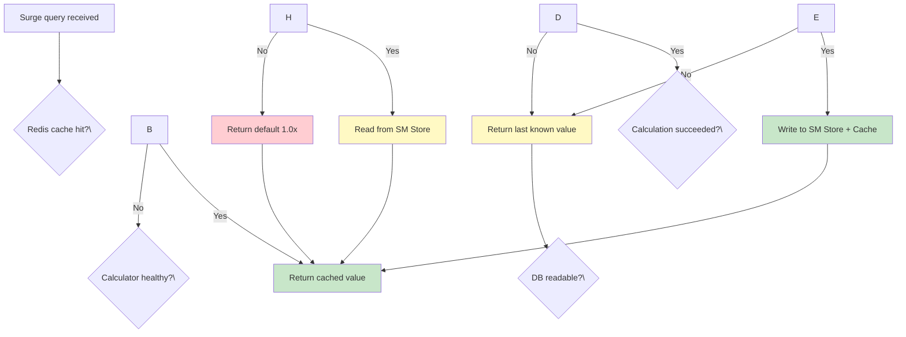
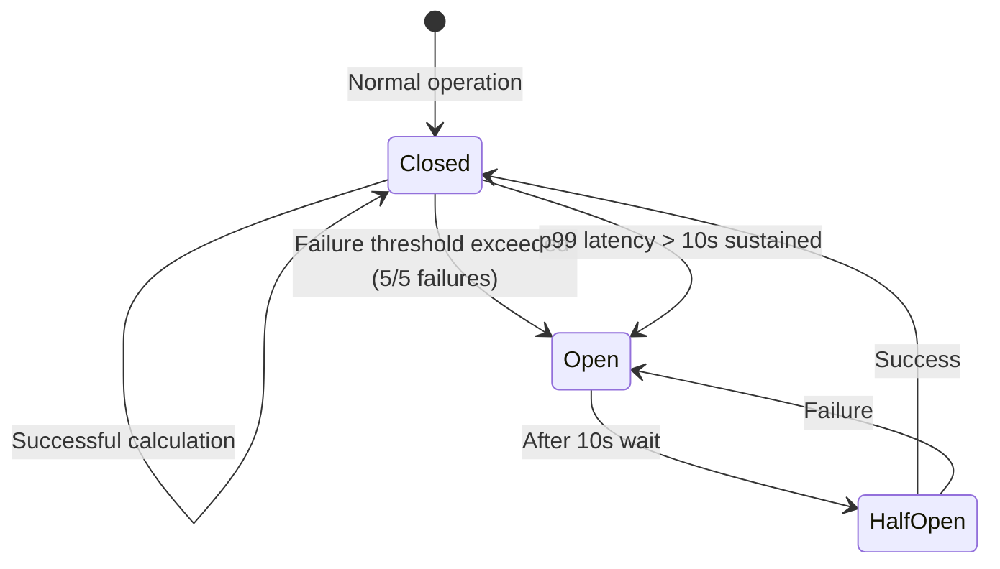
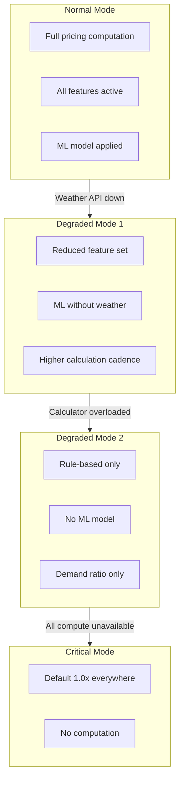
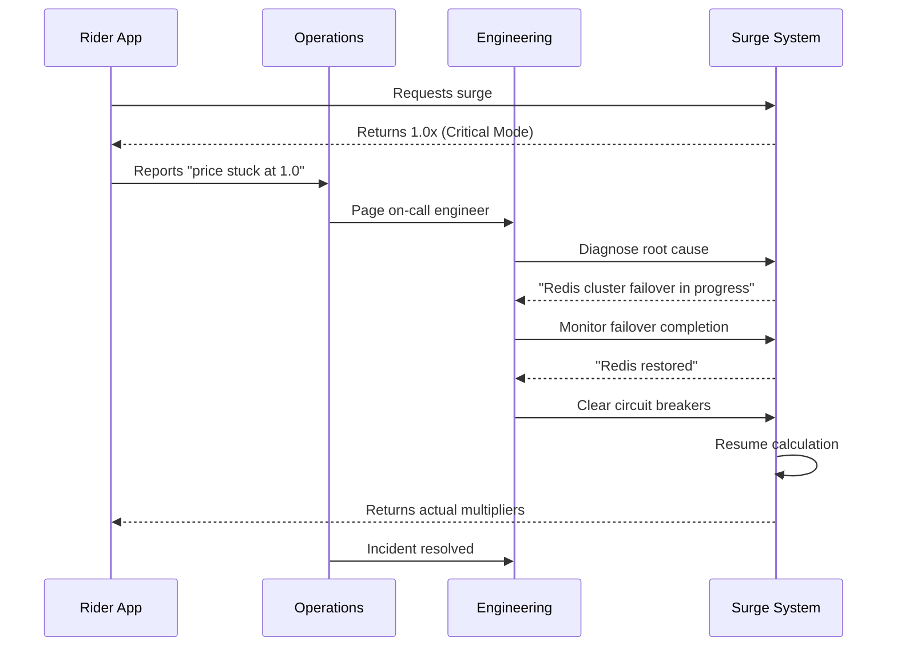

## Fallback Chain

### Multi-Layer Fallback Strategy



The fallback chain has four tiers, each progressively less accurate but always returning a valid multiplier:

| Tier | Source | Latency | Accuracy | When Used |
|------|--------|---------|----------|-----------|
| 1 | Redis cache | &lt;1ms | Highest (fresh) | Normal operation |
| 2 | SM Store (DB) | 5-50ms | High (last known) | Calculator failure |
| 3 | Last known value (in-memory) | &lt;1ms | Medium (stale) | DB + Calculator down |
| 4 | Default 1.0x | &lt;1ms | Lowest | Complete system failure |

**Why not fail fast?** Failing a surge query would make the ride request fail, which is unacceptable UX. It's always better to return an approximate price than to reject the request.

## Circuit Breaker Logic

### Circuit Breaker Per Component



Three circuit breakers operate independently:

#### Calculator Circuit Breaker

```
failure_count = count(failures in last 60s)
if failure_count &gt;= 5:
    trip circuit breaker → use fallback chain
if circuit breaker is OPEN:
    after 10s → test with one zone calculation
    if success → CLOSED, resume normal
    if failure → stays OPEN
```

#### Redis Circuit Breaker

```
failure_count = count(redis errors in last 30s)
if failure_count &gt;= 3:
    trip circuit breaker → read from SM Store directly
if circuit breaker is OPEN:
    after 15s → retry Redis connection
```

#### External API Circuit Breaker (Weather)

```
failure_count = count(weather API errors in last 60s)
if failure_count &gt;= 10:
    trip circuit breaker → skip weather feature
if circuit breaker is OPEN:
    after 300s (5min) → retry
```

The weather API has a long timeout because it's a non-critical feature. Missing weather data reduces model accuracy but doesn't prevent pricing. We tolerate longer open states for this circuit.

### Failure Rate Thresholds

| Component | Failure Threshold | Time Window | Open Duration | Rationale |
|-----------|------------------|-------------|---------------|-----------|
| Calculator | 5/5 | 60s | 10s | Fast recovery for transient compute failures |
| Redis | 3/3 | 30s | 15s | Redis failover takes ~10s |
| Weather API | 10/10 | 60s | 300s | Non-critical, slow recovery acceptable |

## Degradation Modes

### Graceful Degradation Tiers



#### Degraded Mode 1: Weather Feature Disabled

**Trigger:** Weather API circuit breaker open.

**Behavior:** Calculation continues without weather features. The ML model gracefully handles missing weather by defaulting to the temporal baseline (historical average for that time-of-day). Accuracy drops by ~5% but pricing remains functional.

#### Degraded Mode 2: Rule-Only Pricing

**Trigger:** Calculator error rate > 50% or SM Store write latency > 5s.

**Behavior:** Switch to pure rule-based pricing (no ML model). Only the supply-demand ratio base_multiplier is computed. This reduces CPU usage by ~60% and eliminates ML model loading latency. The pricing will be less accurate during unusual conditions (storms, events) but maintains baseline functionality.

#### Critical Mode: Global 1.0x

**Trigger:** Complete system failure — no calculator, no Redis, no DB access.

**Behavior:** All rider apps return 1.0x. This is a "better bad than worse bad" decision — charging the wrong price is bad, but rejecting ride requests is worse. Engineering teams are paged automatically when this mode activates.

### Recovery Procedure



Recovery follows a standard path:
1. Automatic alerting to on-call engineer
2. Root cause identification via metrics dashboard
3. Wait for underlying system to recover (Redis failover, network restoration, etc.)
4. Manual circuit breaker reset via internal dashboard
5. Verify calculation resumes correctly
6. Monitor for 5 minutes to ensure stability
