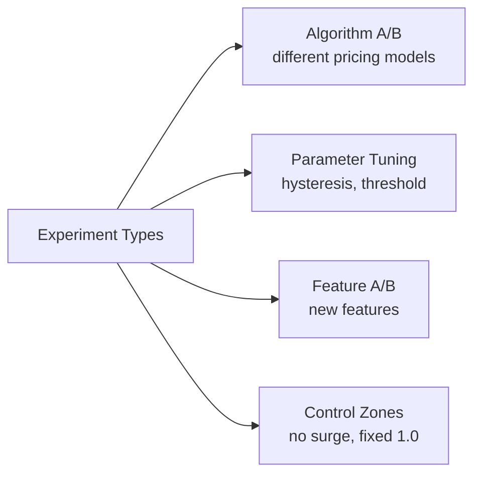
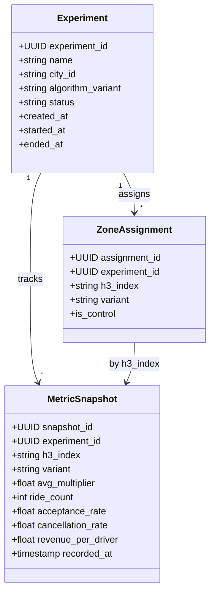
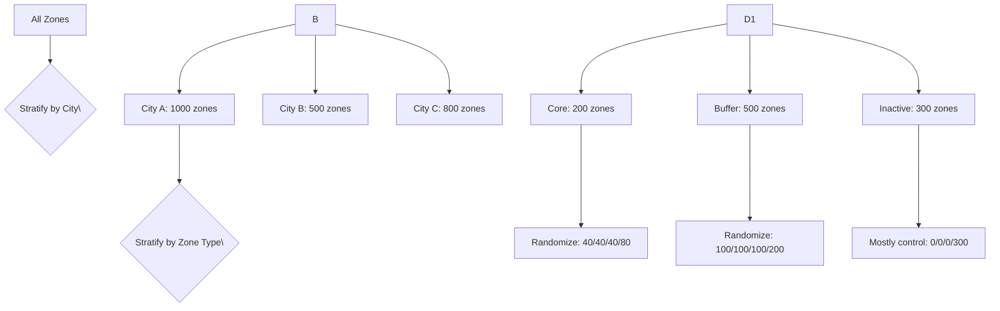

## Experiment Design

### Experiment Types



| Experiment Type | Description | Duration | Zones |
|----------------|-------------|----------|-------|
| Algorithm A/B | Test v3.0 vs v2.3.1 | 2-4 weeks | 20-50 per variant |
| Parameter Tuning | Test 0.15 vs 0.1 hysteresis | 1-2 weeks | 10-20 per variant |
| Feature A/B | Test with weather vs without | 2 weeks | 10 per variant |
| Control Zones | 1.0x fixed pricing for comparison | Ongoing | 5-10 per city |

**Why zone-level assignment instead of user-level?** Surge pricing is zone-based — multiple riders in the same zone at the same time must see the same price. User-level randomization would create pricing confusion and driver skepticism.

### Experiment Structure



## Assignment Strategy

### Zone Randomization

Zones are randomized into variants using a deterministic hash:

```python
def assign_zone(h3_index, experiment):
    hash = md5(f"\{experiment_id\}:\{h3_index\}")
    bucket = int(hash, 16) % 1000  # 0-999
    threshold = experiment.variants_threshold

    if bucket < threshold.control:
        return "control"
    elif bucket < threshold.control + variant_a:
        return "variant_a"
    elif bucket < threshold.control + variant_a + variant_b:
        return "variant_b"
    else:
        return "holdout"  # never shown to riders, for measurement
```

**Why hash-based instead of random assignment?** Hashing ensures a zone always gets the same variant across experiments and restarts. Without this, a zone could switch between control and variant between calculation cycles, contaminating the results.

### Stratification

To ensure balanced randomization, we stratify by city and zone type:



Stratification by zone type is important because core zones have far more data and are more informative for statistical significance. Buffer zones are included but with lower weight since they inherit multipliers. Inactive zones are mostly held out as they never produce ride data.

### Holdout Groups

Each experiment maintains a holdout group (20-25% of zones):

| Group | Displayed to Riders | Used in Experiment Metrics |
|-------|-------------------|--------------------------|
| Control | Yes (standard pricing) | Yes |
| Variant A | Yes (new algorithm) | Yes |
| Variant B | Yes (new algorithm) | Yes |
| Holdout | No (standard pricing) | No — pure measurement baseline |

The holdout is critical for measuring **cannibalization**: the effect of the experiment on riders in neighboring zones. If a variant zone has lower acceptance, the holdout helps determine if riders just switched to nearby non-experimental zones rather than not requesting at all.

## Metrics & Significance

### Primary Metrics

| Metric | Definition | Why It Matters |
|--------|-----------|----------------|
| **Ride Acceptance Rate** | Accepted requests / Total requests | Core indicator of demand elasticity |
| **Revenue Per Driver Hour** | Revenue / Driver online hours | Driver earnings impact |
| **Rider Cancellation Rate** | Cancellations after acceptance / Total accepted | Rider satisfaction proxy |
| **Request Volume per Zone** | Total requests / Active hours | Overall demand level |

### Secondary Metrics

| Metric | Definition | Why It Matters |
|--------|-----------|----------------|
| **Average Wait Time** | Time from request to pickup | Service quality |
| **Driver Supply Growth** | New drivers entering zone | Long-term supply effect |
| **Trip Completion Rate** | Completed / Accepted | Drop-off behavior |
| **Surge Duration** | Minutes at surge > 1.0x | Duration of imbalance |
| **Multi-Zone Requests** | Cross-zone request volume | Geographic effect |

### Statistical Significance Calculation

We use a **Bayesian approach** (Monte Carlo posterior simulation) rather than frequentist p-values because:

1. Bayesian gives a direct probability of improvement: "Variant A is 85% better than control" is more actionable than "p < 0.05"
2. It handles asymmetric distributions naturally (e.g., acceptance rate has a hard ceiling at 100%)
3. It supports sequential monitoring without alpha spending corrections

```python
def Bayesian_AB_Test(control_data, variant_data, n_sims=100_000):
    control_rate = sample_beta(control_data.successes, control_data.failures, n_sims)
    variant_rate = sample_beta(variant_data.successes, variant_data.failures, n_sims)
    improvement = (variant_rate - control_rate) / control_rate

    prob_better = mean(improvement > 0)
    credible_interval = percentile(improvement, [2.5, 97.5])

    return {
        "prob_variant_better": prob_better,
        "credible_interval": credible_interval,
        "expected_improvement": mean(improvement[improvement > 0])
    }
```

### Decision Rules

| Decision | Criteria | Action |
|----------|----------|--------|
| **Declare Winner** | P(variant > control) > 95% AND effect size > 1% | Roll out winner to 100% |
| **Declare Loser** | P(variant > control) < 5% | Stop experiment, rollback |
| **Inconclusive** | 5% < P < 95% OR credible interval includes 0 | Continue running |
| **Stop Early (Harm)** | P(variant < control) > 99% AND metric is negative | Immediate rollback |

### Minimum Detectable Effect (MDE)

For a city with 500 active zones and typical ride volumes:

| Metric | Baseline | MDE | Required Zones per Variant | Duration |
|--------|----------|-----|--------------------------|----------|
| Acceptance Rate | 65% | ±2pp (±3%) | 30 | 7 days |
| Cancellation Rate | 5% | ±0.5pp (±10%) | 20 | 5 days |
| Revenue/Driver | $25/hr | ±$0.50 (±2%) | 50 | 14 days |
| Request Volume | 100/hr/zone | ±5/hr (±5%) | 40 | 10 days |

The acceptance rate is the primary metric and drives the sample size calculation. With 30+ zones per variant in most cities, a 7-day run achieves statistical power > 80%.

### Sequential Monitoring Guardrails

Continuous monitoring is dangerous (peeking problem). We use the following guardrails:

1. **No decisions before 48 hours** — minimum run duration to capture weekday/weekend patterns
2. **No decisions before 100 total events per zone** — avoid low-volume false positives
3. **Bayesian posterior checked every hour** — but no action until minimum criteria met
4. **Automatic stop on harm** — if P(harmful) > 99%, experiment stops immediately
