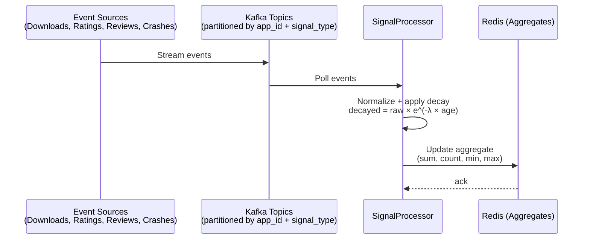
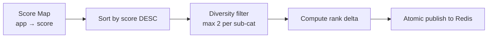
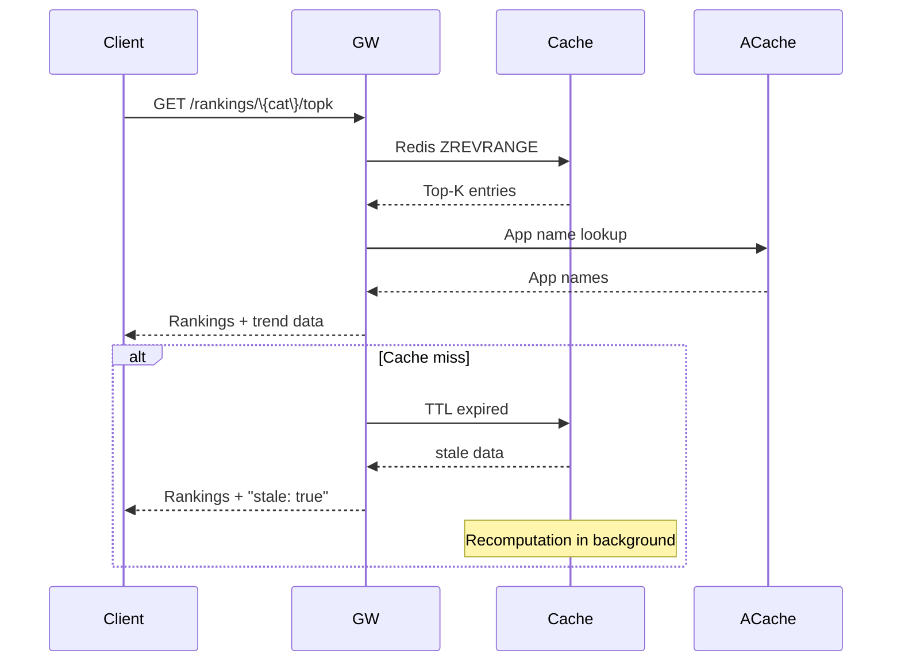

## Signal Ingestion



**Key details:**
- Topics: `store-downloads`, `store-ratings`, `store-reviews`, `app-crashes`, `app-retention`, `store-revenue`
- Signal latency: Event → aggregated in Redis within 1 minute
- **Decay model:** `decayed_value = raw_value × e^(-λ × age_days)`, where λ = ln(2) / half_life (7 days)

## Score Computation

```mermaid
graph TD
    Timer[Every 15min] --> Fetch[Fetch all apps in category/region<br/>from Redis]
    Fetch --> Normalize[Normalize each signal to 0-100<br/>via percentile mapping]
    Normalize --> Weight[Apply signal weights<br/>Σ normalized × weight]
    Weight --> Store[Write score to Redis<br/>score:\{cat\}:\{region\}:\{window\}:\{app\}]
    Store --> Done[Continue]
```

**Score formula:** `total_score = Σ (normalized_signal × weight)`

| Signal | Normalization | Weight |
|--------|-------------|--------|
| Downloads | Percentile rank × 100 | 0.25 |
| Ratings | Rating / 5.0 × 100 | 0.20 |
| Sentiment | (sentiment + 1) / 2 × 100 | 0.10 |
| Crash-free rate | crash_free_rate × 100 | 0.15 |
| Retention | retention_score / 100 × 100 | 0.15 |
| Revenue | Percentile rank × 100 | 0.15 |

**Normalization:** Percentile-based normalization ensures stable 0–100 scale regardless of signal distribution.

## Ranking Update

1. **Sort:** Apps sorted by score DESC per (category, region)
2. **Diversity:** Max 2 apps per sub-category in Top-K; filtered apps pushed down
3. **Delta computation:** `previous_rank` and `score_delta` calculated by comparing with last cycle
4. **Publish:** Rankings written atomically to Redis sorted set `rankings:\{category\}:\{region\}`
5. **TTL:** 15-minute TTL on cache entries



## Query Serving



**Cache hit rate:** > 99% for popular categories; ~90% overall.
**Fallback:** If Redis unavailable, query ScoreCalculator directly (p99 < 100ms).
