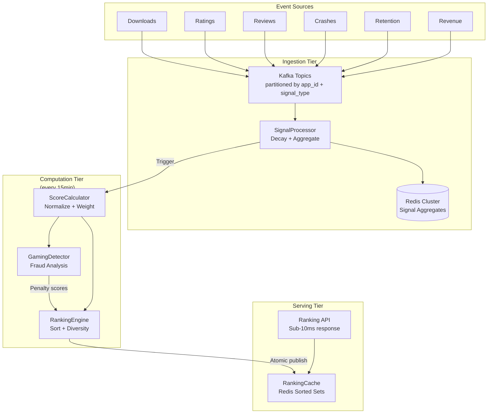

## Architecture Overview

Three-tier, Lambda-architectured system:

### Design principles

- **Pre-computed rankings:** All computation runs on a 15-minute schedule; queries read cached results (zero on-the-fly computation)
- **Independent partitions:** Each (category, region) pair is an independent ranking job — no cross-partition dependencies
- **Speed + batch:** Speed layer (Kafka → Redis) feeds fresh signals; batch layer (full recompute every 15 min) ensures consistency

## Technology Stack

| Component | Choice | Rationale |
|-----------|--------|-----------|
| Message queue | Kafka (partitioned by app_id + signal_type) | High-throughput event ingestion, durable event log |
| Cache | Redis Cluster (16K slots, 3 replicas) | O(log N) sorted sets, sub-ms reads |
| Score computation | Serverless (Lambda / Cloud Run) | Auto-scales on 15-minute trigger |
| NLP pipeline | Fine-tuned BERT on GPU | Accurate review sentiment analysis |
| Anti-gaming | Graph-based fraud detection | Anomaly pattern detection (review bombing, download farms) |

## Component Responsibilities

| Component | Responsibility |
|-----------|---------------|
| **SignalProcessor** | Ingest, normalize, apply decay, update Redis aggregates |
| **ScoreCalculator** | Fetch signals, normalize to 0–100, apply weights, compute composite score |
| **RankingEngine** | Sort by score, apply diversity, compute rank deltas, publish atomically |
| **GamingDetector** | Analyze signal patterns for fraud, output penalty scores |
| **RankingCache** | Store and serve pre-computed Top-K rankings via Redis sorted sets |

## Fault Tolerance

| Failure Mode | Detection | Recovery |
|-------------|-----------|----------|
| Kafka consumer lag > 5min | Monitoring alert | Scale consumer group |
| Score computation failure | Serverless function retry count | Auto-retry; alert on 2nd failure |
| Redis shard failure | Health check | 3-replica auto-failover (< 30s RTO) |
| Serving cache stale | TTL check on read | Return stale data with `stale: true` flag; recompute in background |
| Gaming false positive | Human review feedback | Penalty scores are advisory; manual override via Admin API |
| NLP pipeline failure | GPU instance health | Fall back to keyword-based sentiment (less accurate, but available) |

## Performance Characteristics

| Metric | Value |
|--------|-------|
| Ranking update cycle | 15 minutes |
| Query latency (p99) | < 10ms (Redis ZREVRANGE) |
| Signal ingestion latency | < 1 minute (consumer poll interval) |
| Ranking computation time | < 10 minutes for all category-region pairs |
| Cache hit rate | > 99% (popular categories); ~90% overall |
| Storage: Redis | ~500MB (100K ranking entries × 500B per entry) |
