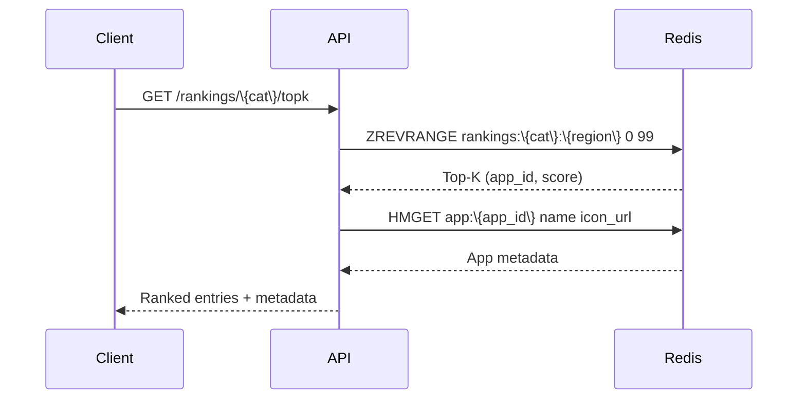

## Cache Architecture

The serving layer uses Redis Cluster for sub-millisecond ranking retrieval.

**Key design: Redis sorted sets** for O(log N) Top-K queries:

```
Key: rankings:\{category\}:\{region\}
Type: ZSET (sorted set)
Score: total_score (composite ranking score)
Member: app_id

Query: ZREVRANGE rankings:Games:US 0 99 WITHSCORES
→ Returns top 100 apps by score in O(log(N) + K)
```

**Data stored per (category, region) pair:**

| Key Pattern | Type | Content | TTL |
|-------------|------|---------|-----|
| `rankings:\{cat\}:\{region\}` | ZSET | app_id → score mappings (K=100 entries) | 15 min |
| `signal:\{app\}:\{type\}:\{region\}:\{window\}` | HASH | aggregated signal values (sum, count, avg) | 1 window cycle |
| `score:\{cat\}:\{region\}:\{window\}:\{app\}` | STRING | precomputed composite score | 1 window cycle |
| `app:\{app_id\}` | HASH | denormalized app metadata (name, icon_url, category) | 1 hour |
| `rank:history:\{app\}:\{cat\}:\{region\}` | ZSET | historical rank trajectory (score, rank, timestamp) | 30 days |

**Cluster topology:** Redis Cluster with 16K hash slots, 3 replicas per shard. Keys partitioned by hash, so a single (category, region) query may touch multiple shards. Pipeline `ZREVRANGE` + `HMGET` to minimize round-trips.

**Read path (99% hit rate):**



## Cache Invalidation

Rankings are **pre-computed and time-based** — no write-through invalidation needed.

**Update cycle (every 15 minutes):**

1. Computation tier finishes ranking for (category, region)
2. Writes new sorted set entries atomically via Lua script:

```lua
-- Atomic replace: old key renamed, new key created, old key deleted
local old = KEYS[1] .. ":old"
redis.call("RENAME", KEYS[1], old)
-- Write new members
for i, v in ipairs(ARGV) do
    redis.call("ZADD", KEYS[1], ARGV[i*2-1], ARGV[i*2])
end
redis.call("EXPIRE", KEYS[1], 900) -- 15 min TTL
redis.call("DEL", old) -- clean up old key
```

3. Clients always read the current key — no stale reads during update

**TTL strategy:**

| Key Type | TTL | Reason |
|----------|-----|--------|
| `rankings:\{cat\}:\{region\}` | 15 min | Matches update cycle; stale data better than no data |
| `signal:*` | 1 window + 5 min buffer | Prevents mid-window evictions |
| `app:*` | 1 hour | App metadata changes rarely; aggressive caching OK |
| `rank:history:*` | 30 days | Trend data needs historical depth |

**Graceful stale handling:** When TTL expires before recomputation finishes, the API returns the last-known rankings with a `stale: true` flag. The recomputation runs asynchronously and refreshes the cache on completion.

## Fallback Strategy

Multiple failure layers with progressive degradation:

| Failure | Level 1 | Level 2 | Level 3 |
|---------|---------|---------|---------|
| **Redis cache miss** (TTL expired) | Return stale data + `stale: true` | Wait for recomputation (5-10s) | Empty response + `updating: true` |
| **Redis cluster failure** | Bypass cache → query ScoreCalculator | Return cached data from API edge (CDN) | HTTP 503 + retry-after |
| **Computation tier slow** | Serve stale rankings | Partial results (rank incomplete categories) | Skip computation, serve previous cycle |
| **High query load** | CDN edge cache (5-min TTL) | API-level request coalescing | Rate limiting (100 req/s per client) |

**Cache bypass for Admin API:** Admin endpoints bypass the ranking cache entirely, querying the computation tier directly. This ensures score adjustments and weight updates are immediately visible to operators.

**Cache warming:** After a full cluster restart or major cache eviction, the Top-K categories (Games, Utilities, Social) are pre-warmed first based on historical query patterns. Less popular categories are warmed on first request (lazy loading).
